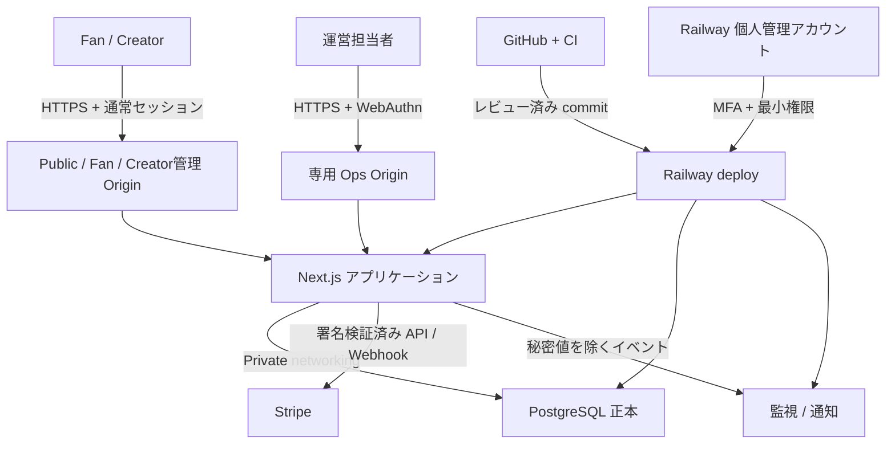
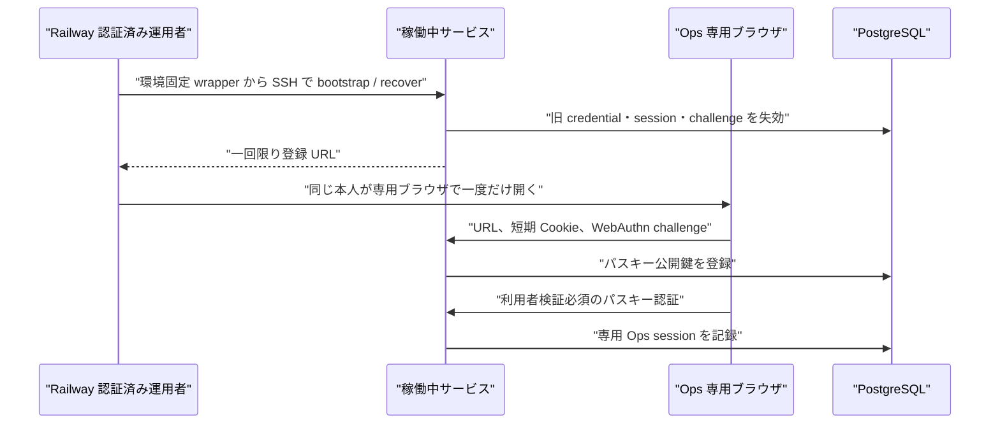
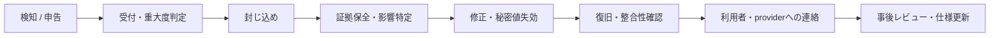

# XXGGLL セキュリティ基本設計

本書は、XXGGLLが何を守り、どの脅威に、どの境界と運用で対処するかを俯瞰する正本である。実装時の細かな条件は
[セキュリティ詳細](./overview.md)、決済・認可・状態遷移を確定させる条件は[コントロール仕様](../core/controls.md)、
日常手順と担当は[運用](../operations/operations.md)を参照する。

## 1. 結論

XXGGLLのセキュリティは、次の五点を中核とする。

1. 証票、台帳、同意、監査ログをサーバー側PostgreSQLの正本とし、クライアントの表示や入力を権限・金額・状態の根拠にしない。
2. Public / Fan / Creator管理とOpsをOrigin、認証器、セッション、read modelで分離し、Opsでも利用者へのなりすましやDB直接接続を許可しない。
3. 本番PostgreSQLを公開せず、Railwayの同一project・environment内のprivate networkingだけでアプリケーションから接続する。
4. カード、銀行口座、本人確認書類をXXGGLLへ取り込まず、Stripeのホスト型画面とトークン化APIへ委譲する。
5. 予防だけで完了とせず、監視、追記専用監査、インシデント封じ込め、バックアップ、復旧訓練までを一つの管理サイクルにする。

この設計は、開発・運用・管理を同一の一人が、一台の管理PCから行う単独運用を前提とする。アプリケーションロールは
`admin`一つ、Railwayの恒常的な人間用membershipは本人の個人アカウント一つとし、二人承認、職務分離、引継ぎ当番を要求しない。
その代わり、固定targetの手順、管理PCと分離したパスキー・回復手段、操作直前の再認証、原子的な状態遷移、追記専用監査、
自動検査、外部監視、機能gate、事後レビューを省略不可の代替統制とする。

## 2. 文書の読み方と正本

| 確認したいこと | 正本 | 判断単位 |
| --- | --- | --- |
| 何を、なぜ守るか | 本書 | 資産、脅威、信頼境界、管理方針 |
| 実装が満たす認証・データ・決済要件 | [セキュリティ詳細](./overview.md) | API、Cookie、トランザクション、保持 |
| 業務操作を確定してよい条件 | [コントロール仕様](../core/controls.md) | 許可、拒否、失敗、証跡、テスト |
| 役割別に何を閲覧・操作できるか | [要件](../core/requirements.md) | 権限マトリクス、受け入れ条件 |
| Railwayで誰が何をいつ行うか | [運用](../operations/operations.md) | 担当、頻度、手順、証跡、復旧 |
| 何をどの制約で保存するか | [データモデル](../core/data-model.md) | DDL、外部キー、制約、状態遷移 |

本書と詳細仕様に差異が生じた場合、実装者が一方を選んではならない。変更Issueで意図、影響、受け入れ条件を明らかにし、
両方の正本を同じ変更で整合させる。

## 3. 適用範囲と前提

| 項目 | 前提 |
| --- | --- |
| サービス | 多数のFanとCreatorが同居するマルチテナントWebサービス |
| 実行基盤 | Railway上のNext.jsモノリス、PostgreSQL、月次課金Cron |
| 外部事業者 | GitHub、Railway、Stripe、メール・OAuth連携元 |
| 重要処理 | アカウント認証、証票取得・譲渡、決済、台帳、属性開示、Creator精算、Ops操作 |
| 運用者・端末 | 開発者、運用者、管理者は同一の一人。通常の管理操作は一台の専用PCだけから行う |
| 保護対象外 | 利用者端末そのもの、Stripe内部、Railway内部、GitHub内部。ただし接続設定、権限、資格情報の管理はXXGGLLの責任 |
| 想定規模 | 単独運営。常時専任SOC、複数人承認、独自WAF、独自SIEMは初期必須としない |
| 非採用 | NFT・暗号資産、ブラウザからのDB直接接続、カード・銀行口座・本人確認書類の自社保持 |

管理の骨格は[NIST Cybersecurity Framework 2.0](https://www.nist.gov/publications/nist-cybersecurity-framework-csf-20)の
Govern、Identify、Protect、Detect、Respond、Recoverを用いる。Webアプリケーションの検証観点は
[OWASP ASVS 5.0](https://owasp.org/www-project-application-security-verification-standard/)を参照し、XXGGLL固有の受け入れ条件へ具体化する。
外部標準への準拠認証を表明するものではない。

## 4. 保護対象と重要度

| 区分 | 主な資産 | 失敗時の影響 | 基本取扱い |
| --- | --- | --- | --- |
| 最重要 | 証票、証票来歴、台帳、返金・精算状態、同意、監査ログ | 金銭・権利状態の不整合、追跡不能 | DB制約、トランザクション、冪等性、追記、バックアップ、復旧試験 |
| 認証秘密 | パスワードハッシュ、セッション、OAuth state、Ops challenge、登録リンク | アカウント・Opsの乗っ取り | 平文非保持、短期・一回限り、ハッシュ照合、失効、ログ禁止 |
| 基盤秘密 | Railway資格情報、DB資格情報、Stripe secret、Webhook secret、メール・OAuth secret | 全利用者・全取引への横断的侵害 | 個人アカウント、MFA、sealed variable、最小権限、ローテーション |
| 個人・関係情報 | メール、プロフィール、属性開示、応援表現、VIP希望、通報 | プライバシー侵害、つきまとい、信用毀損 | 最小収集、用途別read model、同意、即時非表示、エクスポート禁止 |
| 外部決済参照 | Stripe ID、Webhook event ID、Connected Account状態 | 誤送金、重複処理、外部状態との不一致 | 許可リスト、署名検証、イベント冪等性、再照合 |
| 公開情報 | Public説明、公開中プログラムの限定表示 | 列挙、誤表示、対象外データの推測 | 推測困難な個別リンク、同一応答、no-store、検索・一覧非提供 |

カード番号、銀行口座、本人確認書類、パスキー秘密鍵、生体情報、OAuth access tokenはXXGGLLの保存対象にしない。

## 5. 脅威モデル

| ID | 代表的な脅威・失敗 | 最大影響 | 必須の設計回答 |
| --- | --- | --- | --- |
| T-01 | 他人のaccount ID、Creator ID、certificate IDを指定する水平・垂直権限昇格 | 個人情報・資産の漏えい、改変 | Cookieから主体を解決し、所有権・membership・状態を同じサーバー処理で確認する |
| T-02 | パスワード、OAuth、Cookieの窃取・固定・再利用 | 利用者アカウント乗っ取り | ハッシュ化、レート制限、セッション再発行・全失効、same-origin、直近再認証 |
| T-03 | OpsまたはRailwayアカウントの侵害 | 全利用者・全取引への横断アクセス | 専用Origin・パスキー・専用セッション、Railway個人アカウント・MFA・最小権限 |
| T-04 | 変数、ログ、Issue、CI、ローカル端末への秘密値混入 | 基盤・外部連携の侵害 | sealed variable、追跡済みテキスト検査、出力禁止、検知時の即時失効・再発行 |
| T-05 | 決済・Webhook・Cron・再試行の重複または順序逆転 | 二重課金、二重送金、台帳不整合 | 冪等キー、一意制約、署名検証、外部状態再照合、取消行による逆仕訳 |
| T-06 | Creator・staff・Opsへの過剰な属性開示 | プライバシー侵害、関係悪化 | 現在保有者・owner・同意の結合確認、用途別read model、一括出力禁止 |
| T-07 | 不正入力、CSRF、open redirect、Host偽装、列挙、連続試行 | 不正操作、秘密・存在の露出 | 許可リスト、Origin / Referer、同一Origin継続先、Host固定、同一エラー、レート制限 |
| T-08 | 依存関係・CI・デプロイ経路の侵害 | 悪意あるコードの本番実行 | lockfile、最小Actions権限、脆弱性・秘密値検査、レビュー済みcommitからのdeploy |
| T-09 | migration失敗、DB破損、誤操作、Railway障害 | サービス停止、証票・台帳の損失 | pre-deploy、互換migration、PITR・世代バックアップ、復旧目標、復旧訓練 |
| T-10 | 脅迫、性的要求、私的連絡先、場外決済等の投稿 | 利用者の身体・心理・金銭被害 | 投稿前検査、通報・非表示、調査hold、緊急受付、本文を監査へ複製しない |
| T-11 | ログ・監査・エラーへの個人情報や秘密値の出力 | 二次漏えい、長期残存 | 構造化した最小メタデータ、request ID、禁止項目テスト、保持期間管理 |
| T-12 | Railway Dashboardと`railway.toml`、環境間の設定ドリフト | 保護機能の無効化、誤環境操作 | config as code、環境・service明示、変更レビュー、定期差分確認 |

新機能は、正常系だけでなく、権限なし、入力変更、重複、並行、外部失敗、再試行、再起動、ロールバックをこの表へ照合する。

## 6. 信頼境界とシステム構成

| 境界 | 信頼しない入力 | 境界で行う検証 |
| --- | --- | --- |
| ブラウザ → 通常アプリ | ID、価格、権限、継続先、再認証済みフラグ | スキーマ、same-origin、セッション、所有権、DBの現行状態 |
| Opsブラウザ → Ops | 通常Cookie、account名、端末名、IP、Host header | 完全一致Origin / RP ID、パスキー、専用Cookie、adminとcredentialの現行状態 |
| アプリ → PostgreSQL | アプリ内の処理順、並行要求 | private URL、最小DBロール、制約、ロック、トランザクション |
| Stripe → Webhook | 本文、順序、再送 | 署名、event ID一意性、対象イベント許可リスト、Stripe状態再照合 |
| GitHub → Railway | branch、commit、依存関係、CI結果 | protected flow、検査、config as code、pre-deploy、healthcheck |
| 人 → Railway | 共有名義、誤project・environment・service | 個人アカウント、個人2FA（パスキー優先）、最小ロール、対象明示、操作監査 |

## 7. セキュリティ統制の構成

| カテゴリ | 設計方針 | 主な詳細正本 |
| --- | --- | --- |
| GOV: 統治 | リスク受容者、運用担当、変更証跡、例外期限を明確にする | 本書、[運用](../operations/operations.md) |
| IAM: 認証・認可 | 通常利用者、Creator、staff、Ops、Railway管理者の境界を分離する | [認証・認可・Ops](./identity-and-access.md)、[要件](../core/requirements.md) |
| APP: アプリ防御 | サーバー側検証、CSRF、redirect・Host制限、レート制限、安全な応答を共通化する | [認証・認可・Ops](./identity-and-access.md)、[コントロール仕様](../core/controls.md) |
| DATA: データ保護 | 最小収集、用途別read model、同意、保持、非表示、匿名化を設計する | [データ・プライバシー](./data-and-privacy.md)、[データモデル](../core/data-model.md) |
| PAY: 決済・台帳 | Stripe委譲、署名、冪等性、追記台帳、返金・送金前の再照合を行う | [取引・不正・利用者安全](./transactions-and-safety.md)、[コントロール仕様](../core/controls.md) |
| PLAT: Railway基盤 | private networking、環境分離、sealed variable、最小権限、config as codeを使う | 本書、[運用](../operations/operations.md) |
| DET: 検知 | アプリ監査、Railwayログ・metrics・webhook、セキュリティ通知を組み合わせる | [運用](../operations/operations.md) |
| RESP: 対応 | 受付、判定、封じ込め、証拠保全、連絡、再発防止を担当付きで実行する | [運用](../operations/operations.md) |
| REC: 復旧 | rollback、PITR、世代バックアップ、整合性照合、復旧訓練を行う | 本書、[運用](../operations/operations.md) |
| SDLC: 開発 | lockfile、CI、秘密値検査、脆弱性例外、受け入れ条件をrelease gateにする | [セキュリティ概要](./overview.md)、[運用](../operations/operations.md) |

## 8. 認証・認可の基本設計

### 8.1 通常利用者とCreator

- 通常利用者の主体はサーバーがCookieから解決する。クライアントから受け取ったaccount IDを本人性の根拠にしない。
- Creator権限は、現在のaccount、Creator membership、permission、対象Creatorを同じ要求で結合して確認する。
- 認証、登録、OAuth完了後はセッションIDを再発行し、継続先は同一Originの許可済み相対パスだけにする。
- パスワード変更、OAuth解除、全端末ログアウト、精算申請等は、対象ごとに定義した直近再認証をサーバーで確認する。
- UIの非表示は認可の代替にしない。通常の保護画面は未認証要求へデータを返さない`401`、認証済みだが認可のない対象と不存在対象へ同じ`404`を返す。Opsは専用認証前の例外endpointを除き、通常sessionを含む未認証・認可なし・不存在を同じ`404`にする。

### 8.2 Ops

- Opsは通常ログインと別のHTTPS Origin、WebAuthn RP ID、`admin_session`、Cookieを使う。
- 初回登録、全credential喪失後の復旧、ロール解除は、通常Web APIやローカルDB接続では行わない。
- 現行の運用入口は`dev`専用の`npm run ops:setup`とし、固定`dev` targetへのSSH委譲以外を拒否する。固定`dev` targetをproductionへ流用しない。
- productionの初回登録・復旧・解除は、`dev`と同じ操作境界を保つproduction専用固定target、対象accountの一意性、actionごとの固定理由、
  旧credentialの一括失効、監査、管理PC喪失時のoff-device回復手順を定義したrunbookとtestが完成するまで有効化しない。
- 返金、送金、強制失効、プログラム終了、credential変更は、5分以内のOpsパスキー再認証を必須にする。
- Opsは一人の対象を選ぶ用途別read modelだけを返す。利用者・Creatorへのなりすまし、一括取得、更新APIのadmin bypassを持たない。
- IP、端末名、User-Agent、ブラウザ指紋を本人認証要素にしない。

## 9. Railway 基本設計

基盤設定は、Railwayの[Production Readiness Checklist](https://docs.railway.com/overview/production-readiness-checklist)と
[Best Practices](https://docs.railway.com/overview/best-practices)をXXGGLLへ具体化する。参照日は2026年8月16日とする。

### 9.1 採用基準

| 項目 | XXGGLLの必須構成 | 根拠・注意 |
| --- | --- | --- |
| プラン | 本番はHobbyを継続する | Pro固有のworkspace 2FA enforcementは採用せず、本人の個人2FA、単一membership、off-device回復、月次権限reviewを補償統制として必須にする。Pro化を公開条件にしない |
| project | 関連するWeb、Cron、PostgreSQLを同一projectに置く | private networkingとreference variableを使う |
| environment | `production`と`dev`を分離する | [Railway environments](https://docs.railway.com/environments)は環境ごとにservice・変数・networkを分離する。XXGGLLでは`dev`をstaging相当の唯一の常設非本番環境とする |
| PR環境 | baseを`dev`とし、本番sealed secret・本番データを複製しない | sealed variableはPR環境や複製環境へコピーされないため、専用の非本番値を設定する |
| 公開面 | WebのPublic / Fan / Creator管理 OriginとOps Originだけ | PostgreSQLと内部serviceへpublic domain・TCP proxyを付けない |
| DB接続 | private hostnameを参照する`DATABASE_URL`だけ | [Private Networking](https://docs.railway.com/private-networking)は同じproject・environment内だけで有効 |
| 変数 | reference variableを優先し、秘密値はsealedにする | [Sealed variables](https://docs.railway.com/variables)はUI・API・CLIで値を再取得できず、複製もされない |
| Deploy設定 | `railway.toml`を正本とし、Dashboard差分を定期確認する | build、pre-deploy、start、healthcheck、restartをレビュー可能にする |
| migration | `preDeployCommand`でpreflight後に実行する | [Pre-deploy command](https://docs.railway.com/deployments/pre-deploy-command)の失敗時はdeployを進めない |
| readiness | `/api/health`、100秒timeout | [Railway healthcheck](https://docs.railway.com/deployments/healthchecks)はdeploy開始時だけであり、継続監視の代替ではない |
| 再起動 | Webは`ON_FAILURE`、最大10回。Cronは`NEVER` | 無限再起動で障害を隠さず、失敗を通知して原因を除去する |
| 切替 | Webはoverlap 30秒、draining 30秒を目標にする | 長時間要求とSIGTERMを検証し、migrationは旧版と新版の両方から利用できる順序にする |

`production`をEnterpriseのrestricted environmentにする場合は、[Environment RBAC](https://docs.railway.com/enterprise/environment-rbac)を有効にする。
Enterpriseを採用しない間は、project memberを必要最小限にし、`dev`を通常調査先とすることで補う。

### 9.1.1 Hobby継続の判断

Railway公式の[2FA enforcement](https://docs.railway.com/access/two-factor-enforcement)はworkspace全体へ2FAを要求する機能であり、現行のHobby運用では採用しない。XXGGLLは、Pro化によってこの機能を得ることよりも、単独運用の実態に合わせてHobbyを継続することを選ぶ。この判断はworkspace全体の強制が不要になったことを意味せず、個人アカウントの2FAを必須にしたうえで、単一membership、分離認証器、off-device回復、月次の権限・session・token reviewを組み合わせる補償統制である。

個人2FAはworkspace 2FA enforcementと同等ではないため、認証状態または回復手段を確認できない場合はRailway管理操作と本番公開を停止する。将来、運用者を増やす、workspace全体への強制が必要になる、またはHobbyの保持・監査制限を受容できなくなった場合は、Pro化を再評価し、Issueで仕様と公開gateを同時に更新する。

### 9.2 Railwayアカウントと権限

- 共有アカウントを禁止し、[Project Members](https://docs.railway.com/projects/project-members)の人間用membershipは、運用者本人の
  Project Owner一つを原則とする。常設の追加Owner、Editor、Viewer、代替者を作らない。
- Railwayの個人アカウントで2FAを有効にし、[Railway passkey](https://docs.railway.com/access/multi-factor-authentication)を管理PCと分離した認証器へ少なくとも1つ登録する。TOTPだけの登録は本番公開条件を満たさない。
  パスキー認証器はスマートフォンまたはhardware authenticatorとする。workspaceの[2FA enforcement](https://docs.railway.com/access/two-factor-enforcement)はHobbyでは利用しないため、個人2FAはworkspace全体への強制と同等ではない。
- 個人2FAが無効、認証器を利用できない、またはoff-device回復手段を確認できない場合は、本番のRailway管理操作と公開判定をNo-Goにする。
- 回復コードは管理PC、リポジトリ、Issue、チャットと分離し、本人だけが利用できる暗号化済みoff-device保管または封緘した紙で保管する。
  使用後は再発行する。管理PCだけを回復経路にしない。
- API・project tokenは人の操作に流用せず、CIごとに最小scopeと失効手順を持たせる。個人2FAはtoken利用の保護を代替しない。
- 管理PC、個人アカウント、パスキーの紛失・侵害時は、off-device回復手段またはprovider supportからsession、token、Ops credentialを失効し、
  安全な代替PCを再構築するまで通常の管理操作を再開しない。

### 9.3 PostgreSQL、バックアップ、復旧

Railwayのdatabase templateは運用責任まで含むmanaged databaseではない。Railway公式も、backup、disaster recovery、
security、monitoring、maintenanceを利用者責任としているため、template作成だけで保護済みと判断しない。

| 対象 | 目標 | 実現方法 |
| --- | --- | --- |
| PostgreSQL通常時RPO | 5分以内を目標 | [Point-in-Time Recovery](https://docs.railway.com/volumes/point-in-time-recovery)を有効化し、archive状態を監視する |
| PostgreSQLフォールバックRPO | 24時間以内 | [Railway Backups](https://docs.railway.com/volumes/backups)の日次・週次・月次scheduleを有効にする |
| PostgreSQL RTO | 4時間以内 | 新規restore serviceを作り、整合性確認後に参照先を切り替えるrunbookを使う |
| Web / Cron RPO | 永続データなし | commit SHAとconfig as codeから再deployする |
| Web RTO | 1時間以内 | 前回正常deploymentへのrollbackまたは同一commitの再deploy |
| 復旧検証 | 四半期ごと | production同等のアクセス制御を持つ一時recovery serviceへ復元し、migration状態、件数、台帳整合性を記録する |

RTOは本人が通知を認知し、復旧操作を開始してからの技術作業時間とする。障害発生からの経過時間には通知認知までの時間が加わる。
発生時点からのRTOは外部へ保証しない。保証が必要になった場合は、単独運用という前提と自動復旧範囲を再設計する。

PITRは非同期archiveであり、外部保存障害時に目標RPOを満たさない可能性がある。月次の暗号化済み論理バックアップを
Railway workspaceと別のアクセス境界へ保存する。保存先、鍵管理者、保持期間が決まるまでは有料決済を公開しない。
復元先を本番へ直接上書きせず、必ず別serviceで復元・照合してから切り替える。
四半期drillはPITRまたは外部論理backupから、通常の`dev`とは別の一時recovery serviceへ復元する。Railwayのnative volume backupは、復元時に元serviceの
mountを新しいvolumeへ差し替えるため、本番serviceを使う定期drillには用いず、PITRが使えない実incidentのfallbackとする。

### 9.4 監視

- Railwayのresource monitorでCPU、RAM、disk、network egressを監視し、deploy失敗・crash・volume警告を
  [Railway webhook](https://docs.railway.com/observability/webhooks)から運用通知先へ送る。
- Railway healthcheckは継続監視ではない。Public OriginとOps Originに外形監視を置く。Public Originは`GET /api/health`、Ops Originは`GET /ops/health`を使い、Hostを相互に流用しない。
- `GET /ops/health`は完全一致する`OPS_ORIGIN`のHostだけで認証前に応答する監視専用endpointとする。正常時は`200`とJSONの`status`フィールド`ok`、processまたは必須の非秘密設定が利用不能な場合は`503`と`status`フィールド`unavailable`を返し、`Content-Type: application/json`、`Cache-Control: no-store`を付ける。account、admin role、credential、session、DB内容、version、commit、deployment ID、secretの有無や値を返さない。
- Ops healthはDB・Stripe・メールへ接続せず、業務read modelと監査対象データを読まない。`GET`以外、query付き、完全一致しないHostは`404`とし、rate limitを適用する。Ops Originの`/api/health`は引き続き`404`とする。
- Railway metricsはrequest latency、application error rate、決済失敗率等を収集しないため、アプリケーション側で最小限の集計値を送る。
  詳細は[Railway Metrics](https://docs.railway.com/observability/metrics)を前提に補完する。
- runtime logは構造化し、level、event、request ID、environment、service、deployment IDだけを基本属性とする。
  秘密値、メール本文、メッセージ本文、Cookie、決済詳細を出さない。
- [Railway Logs](https://docs.railway.com/observability/logs)と[Railway Audit Logs](https://docs.railway.com/enterprise/audit-logs)の保持期間に依存せず、必要な長期証跡はアプリの追記専用監査ログまたはアクセス制限した外部保存へ残す。

## 10. 責任分界

| 領域 | Railway | XXGGLL運営 | Stripe / GitHub等 |
| --- | --- | --- | --- |
| 物理基盤・Railway platform | platformの提供と障害対応 | plan、region、権限、設定、監視、障害時判断 | 対象外 |
| service間network | private networking機能 | public面の削除、private URL利用、Host・Origin検証 | 対象外 |
| PostgreSQL | container、volume、backup・PITR機能 | DB権限、公開停止、backup schedule、restore試験、整合性 | 外部backup先は別管理 |
| アプリ認証・認可 | runtimeの提供 | 設計・実装・テスト・監査・失効 | OAuth元は本人認証の一部だけを提供 |
| 決済 | runtime・network | 金額、台帳、冪等性、Webhook、返金・送金判断 | Stripeがカード・口座・本人確認と決済状態を管理 |
| source・CI | GitHub連携deploy | branch運用、review、Actions権限、依存関係・秘密値検査 | GitHubがrepositoryとActions platformを提供 |
| incident | platform incidentの告知 | 利用者影響の判定、封じ込め、証拠、連絡、復旧、再発防止 | 各providerへ調査・失効・異議申立てを依頼 |

外部事業者の機能を使うことと、XXGGLLがその機能を正しく構成・監視・復旧する責任は別である。

## 11. 管理運用体制

管理上の責任者と実施者は、いずれも単独運用者本人とする。存在しない部署や代替担当を帳票上だけ設けず、一人が判断・実施した事実を
個人アカウント、CI結果、Issue、release記録、incident記録で追跡できるようにする。法務、会計、provider support等への相談は必要時に行うが、
相談先へRailwayやOpsの恒常的な資格情報を付与しない。

| 管理機能 | 実施者 | 一人運用で省略しない統制 |
| --- | --- | --- |
| リスク受容、公開・停止・復旧判断 | 単独運用者 | 機能gate、判断理由、未解決riskと期限の記録 |
| Railway、秘密値、backup | 単独運用者 | 個人passkey、固定target、sealed secret、off-device回復、restore drill |
| 実装、CI、migration、release | 単独運用者 | 自動test、CI gate、commit SHA、rollback、単一のGo / No-Go記録 |
| 返金、送金、強制失効等のOps操作 | 単独運用者 | 5分以内の再認証、原子的失効・状態遷移、全件監査 |
| 監視、初動、封じ込め、復旧 | 単独運用者 | 外部監視、通知、最小範囲の停止、証拠保全、事後review |
| 個人情報・保持・通知判断 | 単独運用者 | 最小read model、保持方針、必要時の外部専門家相談 |

頻度、証跡、停止、復旧手順は[運用](../operations/operations.md)を正本とする。

## 12. 検知・対応・復旧の流れ

| 重大度 | 例 | 初動目標 | 最初に行うこと |
| --- | --- | --- | --- |
| SEV-1 | 基盤秘密漏えい、Ops侵害、DB公開、台帳破損、進行中の個人情報漏えい | 即時通知し、本人が通知を認知してから30分以内に封じ込め開始 | 公開面・token・session・高リスク機能を止め、証拠を保全する |
| SEV-2 | 限定的な権限逸脱、決済・Webhook異常、継続的な認証攻撃 | 即時通知し、本人が通知を認知してから4時間以内に緩和開始 | 対象機能を止め、account / event / deploymentを特定する |
| SEV-3 | 単発エラー、低影響の脆弱性、監視閾値超過 | 1営業日以内にtriage | Issue化し、再現・影響・期限を決める |

単独運用では24時間の有人応答を約束しない。24時間の即時対応を必要とする機能は、外部受付と安全側へ自動停止する仕組みが完成するまで
公開しない。法令・契約上の通知要否と期限は、影響、データ種別、当事者、地域を確認し、必要に応じ外部専門家へ相談して判断する。

## 13. リリースゲート

| Gate | 公開条件 | 証跡 |
| --- | --- | --- |
| G-01 仕様 | 影響する要件、脅威、コントロール、保持、rollbackをIssueに記録 | 正本URL、受け入れ条件 |
| G-02 開発 | typecheck、unit、integration、build、依存関係・秘密値検査が成功 | commit SHA、CI run |
| G-03 認可 | 正常、未認証、他人、role変更、並行失効、直接URLを確認 | 自動テスト、必要な手動確認 |
| G-04 Railway | 対象environment / service、private DB、sealed secret、個人2FA、healthcheck、restart、通知を確認 | release checklist |
| G-05 データ | migrationが前後version互換で、backupとrollback方針がある | migration check、復旧点 |
| G-06 決済 | Stripe test、Webhook署名・重複・順序違い、台帳・返金・送金境界を確認 | test結果、機能gate |
| G-07 Ops | 専用Origin、パスキー、再認証、失効、404、監査を確認 | Ops security checklist |
| G-08 復旧 | PITR・backup・外部backup先・off-device回復手段が有効 | 最新のrestore drill、回復確認記録 |

一つでも該当Gateを満たさない機能は、サーバー側機能gateで公開しない。画面だけ隠して完了扱いにしない。

## 14. 現行レビューで確定した判断と残件

### 14.1 Repositoryで確認できたこと

| 対象 | 現状 | 必要な対応 |
| --- | --- | --- |
| Web deploy | `railway.toml`にpreflight、migration、`/api/health`、100秒timeout、`ON_FAILURE`最大10回、overlap 30秒、draining 30秒がある | releaseごとに実際のRailway適用値を照合する |
| Cron deploy | 専用TOMLにmigration、月次schedule、`NEVER`がある | 失敗通知と冪等な手動再実行を確認する |
| `dev` Ops初期設定 | `npm run ops:setup`がRailway本人確認後に固定`dev` targetへSSH委譲し、対象accountが一意でない場合は停止する | production targetへ流用せず、`dev`でbootstrap・recover・revokeを検証する |
| Railway live設定 | plan、個人2FA、member、public TCP proxy、sealed variable、PITR、backup、monitorはrepositoryだけでは確認できない | 本番公開前にDashboardと監査証跡で確認する。workspace 2FA enforcementを前提にしない |

### 14.2 `dev`実環境で確認できたこと

| 対象 | 確認済み | 未確認 | 証跡 |
| --- | --- | --- | --- |
| overlap / draining | `dev` Webでoverlap 30秒、draining 30秒、長時間要求、新deploymentへの新規要求切替、draining超過時の切断、再deploy中の`/api/health`継続`200`を確認し、#189を完了した | Railway runtime logでSIGTERM受信時刻と終了までの経過時間を証跡化すること | [Issue #189](https://github.com/odokura/xxggll/issues/189)は完了。[Issue #195](https://github.com/odokura/xxggll/issues/195)でSIGTERM実測だけを継続する |

### 14.3 判断と未決定事項

| 種別 | 判断・残件 | 公開への影響 |
| --- | --- | --- |
| 確定 | 本番RailwayはHobbyを継続し、個人2FA（パスキー優先）、単一membership、private DB、sealed secretを基準とする | 個人2FA、off-device回復、単一membership、月次reviewのいずれかを満たせない場合は本番公開不可。Pro化は前提にしない |
| 確定 | Railway healthcheckはdeploy readinessだけに使い、外形監視を別に置く | 外形監視がなければ本番公開不可 |
| 確定 | PITR、日次・週次・月次backup、四半期restore drillを行う | 最新drillが失敗中なら有料機能を停止 |
| 未決定 | 外形監視service、application metrics、Railway webhookの通知先 | 選定・通知試験まで本番公開しない |
| 未決定 | Railway外の暗号化backup保存先、鍵管理者、具体的保持期間 | 決定・検証まで有料決済を公開しない |
| 未決定 | 会計、監査、通報、メッセージ、個人情報の具体的保持年数と匿名化手順 | アカウント閉鎖完了と期限到来の自動削除を公開しない |
| 未決定 | 24時間緊急受付先と、安全側へ自動停止する手段 | 完成・検証までVIP・個別メッセージ機能を公開しない |
| 未決定 | production Opsの固定target wrapper、対象account一意性、action別固定理由、off-device回復、復旧訓練 | 完成・検証までproduction Opsと高リスクOps操作を公開しない |
| 受容 | 開発・運用・管理は一人、一台の管理PC、アプリケーションの運用ロールはadmin一つで、複数人承認を設けない | 固定target、PC外のpasskey・回復手段、再認証、原子的統制、全件監査、自動検査、定期事後reviewを必須にする |

## 15. 基本設計の受け入れ条件

- 資産、脅威、信頼境界、統制カテゴリ、責任分界が相互に追跡できる。
- Fan、Creator、staff、Ops、Railway管理者の認証・認可境界を説明できる。
- Railwayのproject、environment、network、variable、deploy、backup、monitor、権限の採用方針が定義されている。
- Railwayが提供する機能と、XXGGLLが構成・監視・復旧する責任を区別できる。
- PublicとOpsの外形監視endpoint、Host境界、正常・異常応答、禁止情報を区別できる。
- RPO、RTO、backup、restore drill、rollbackの目標と担当が定義されている。
- 平常時、release時、incident時、管理PC・credential変更時の単独運用者と証跡を特定できる。
- 未決定事項が機能gateに結び付き、未決定のまま危険な機能を公開できない。
