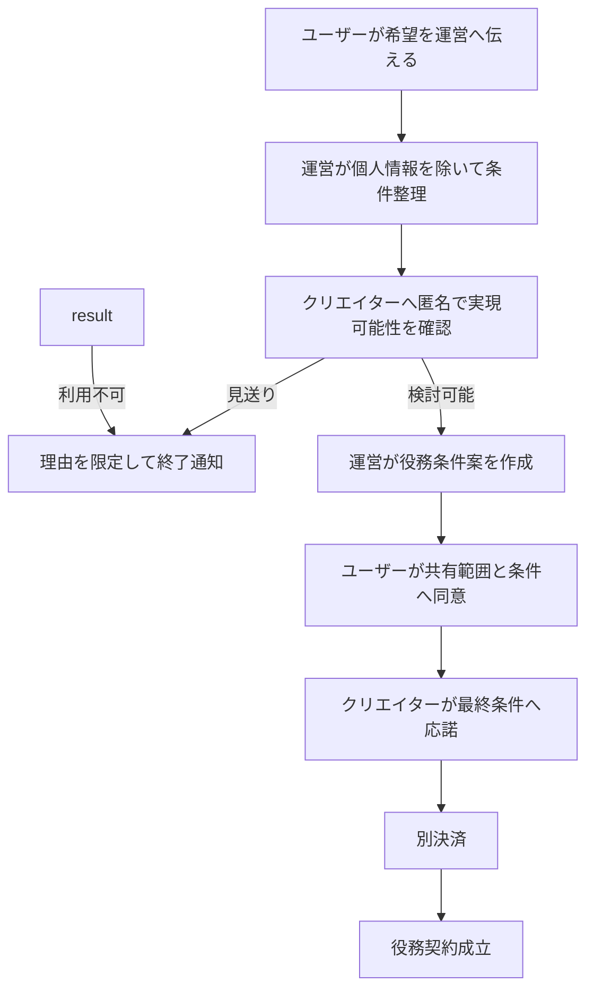

# 任意提供・個別役務

XXGGLL本体は、すべてのランクで取得だけによるクリエイター役務を発生させない。本ページは、
販売前に完成している任意固定コンテンツ、XXGGLLとは別に販売する商品・サービス、
VIP・ExtraVIPで個別合意する役務の境界を扱う。
関係記録の内容は[関係記録・コンテンツ](./content.md)を正本とする。

## 提供区分

| 区分 | 例 | XXGGLL取得による発生 | クリエイターの個別作業 |
| --- | --- | --- | --- |
| R0 運営生成 | 証票画像、バッジ、履歴、継続記念 | 自動で発生 | なし |
| R1 ユーザー生成 | 応援理由、属性プロフィール、メッセージ | ユーザーが任意入力 | 閲覧・返信義務なし |
| R2 任意固定 | 販売前に完成済みの画像、音声、動画、共通メッセージ | 登録済みの場合だけ自動配信 | 販売後はなし |
| S1 別商品 | 物品、イベント券、予約、限定配信、個別制作 | 発生しない | 別商品の条件に従う |
| S2 VIP・ExtraVIP役務 | 個別収録、時間制限付き対話、個別企画 | 発生しない | 個別契約後だけ発生 |

R0からR2だけをXXGGLL画面内に表示できる。S1とS2は、XXGGLLの保有価値やランク特典として
自動付与せず、別の申込み、価格、契約、取消条件を持たせる。

## XXGGLL本体へ含めてはいけないもの

- 販売後の定期投稿、最低投稿回数、更新義務
- 購入者ごとの名前入れ、個別メッセージ、個別制作
- 物品の発送、席や在庫の確保
- 優先購入、割引、抽選優遇、予約受付
- DM、返信、コメント、通話、面会
- 外部コミュニティへの参加権
- クリエイター本人による閲覧、認知、推薦の保証

これらを提供する場合はS1またはS2として分離し、XXGGLLを購入しなくても商品・役務の内容と
対価を判別できる表示にする。

## R2 任意固定コンテンツ

任意固定コンテンツは、クリエイターが販売開始前に完成・登録し、運営が購入者へ自動配信できる
デジタル素材に限定する。

| 項目 | ルール |
| --- | --- |
| 登録数 | 1ランクにつき最大3件 |
| 個別化 | 証票番号、ランク、表示名の機械的差し込みだけ許可。個別制作と表示しない |
| 更新 | 更新義務なし。差し替えは権利侵害、誤情報、安全上の理由に限る |
| 権利 | 配信・表示・譲渡後閲覧の範囲を販売開始前に確認する |
| 譲渡 | 買い手の閲覧可否を公開前に固定し、購入画面に表示する |
| 価格表示 | XXGGLL価格の主要な対価として訴求しない |
| 停止 | 権利・安全上の問題がある場合は運営が停止し、証票と関係記録は維持する |

## S1 別商品

物品、チケット、予約、割引、限定配信、個別制作等はXXGGLLと別の商品として扱う。

- XXGGLLの保有を購入条件にしてもよいが、XXGGLL取得時に自動発生させない。
- クリエイターまたは提供者が販売開始を明示的に選び、数量、価格、期限、取消、返金を設定する。
- 運営が在庫、申込み、決済、通知を処理し、上限到達後は自動停止する。
- XXGGLLの継続支援を停止しても、成立済みの別商品の契約条件は変更しない。
- 別商品を提供しないことを、XXGGLLプログラムの不履行として扱わない。

## S2 VIP・ExtraVIP個別役務

VIP・ExtraVIPでは、次の順序をすべて完了した場合に限り役務契約を成立させる。

契約前に次を確定する。

- 提供内容と成果物
- 対象人数、回数、1回の時間、実施期限
- 連絡手段と運営の同席・記録範囲
- 価格、追加費用、税、決済時期
- 日程変更、取消、返金、代替
- 禁止事項、安全中止条件、通報方法
- 成果物の利用権、公開範囲、保存期間
- 対象コンテンツ・役務が本人確認を必要としない内容であること

クリエイターは匿名打診、条件案、最終条件の各段階で見送れる。最終応諾前は役務義務を負わず、
見送り理由の詳細をユーザーへ開示する義務もない。

VIP・ExtraVIPであること自体、XXGGLLの購入、役務相談の開始には本人確認を要求しない。法令上の本人確認が必要な
契約対象のコンテンツ・役務は提供しない。

## 責任分担

| 主体 | 責任 |
| --- | --- |
| 運営 | 商品・役務の分離表示、条件テンプレート、同意、決済、上限管理、記録、通報 |
| クリエイター・提供者 | 任意に開始したS1・S2の実現可能性確認、権利確認、合意済み範囲の履行 |
| ユーザー | 正確な情報の入力、条件と期限の順守、必要な取消連絡、禁止事項の順守 |

## 履行不能時

- S1・S2だけを停止し、XXGGLL証票、個人支援履歴、その他の保有関係は維持する。
- 同等の代替はユーザーが明示同意した場合だけ成立する。
- 代替に同意しない場合は、未履行部分の別商品・役務代金を返金する。
- クリエイターの責任によらない安全中止でも、未提供部分の精算方法を契約条件に従って表示する。
- XXGGLLの一次支援額、継続支援額、二次流通額を役務返金へ流用しない。

## 禁止する役務

- 性的サービス、交際、出会いの仲介
- 私的連絡先の交換を前提にするもの
- 無制限DM、常時応答、終了条件のない相談
- 違法行為、危険行為、規約違反を求めるもの
- 運営の記録・通報・安全停止を回避する外部取引

役務契約、返金、個人情報、事故、知的財産権に関する条件は、実装・販売開始前に法務レビューを行う。
