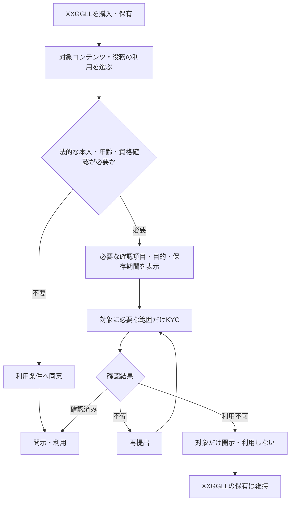

# 属性開示・条件付き本人確認

本ページは、ユーザーがクリエイターへ共有できる属性、同意、表示、撤回と、
法的に必要な場合だけ実施するKYCを扱う**属性開示・本人確認の正本**である。

## 概要

属性開示は、ユーザーが自分で選んだ情報を、同意した目的と共有先の範囲でクリエイターへ届ける仕組みである。
共有情報は自己申告として扱い、XXGGLLの購入・保有・譲渡や通常の属性共有にKYCを要求しない。
KYCは、対象コンテンツまたはVIP・ExtraVIP役務の開示・利用に、法令上の本人・年齢・資格確認が必要な場合だけ実施する。

## ユーザー向け整理

| 項目 | ユーザーの操作・選択 | クリエイターに共有される情報 | KYC |
| --- | --- | --- | --- |
| 閲覧・待機リスト | 閲覧は自由。待機登録はメールアドレス等の通知先、またはログイン済みアカウントを登録 | 共有しない | 不要 |
| 無料取得 | 最小限のアカウントで取得 | 証票の公開設定に従う | 不要 |
| 一次・二次購入、継続支援、証票支援 | 最小限のアカウントと決済情報を用意 | 証票の公開設定、同意済み属性 | 不要 |
| クリエイター報酬の受領 | アカウントを使用。報酬受領時は振込先情報を決済事業者へ提供 | 決済カード情報や振込先情報は共有しない | XXGGLLのDidit KYCは不要。決済事業者が求める本人確認・口座確認は別途必要 |
| 属性共有 | 共有先、項目、目的を選び、表示内容を確認して同意 | 表示名、年代、地域、職業・業界、興味、応援理由、活動歴、希望する呼称等の同意済み項目 | 原則不要 |
| 条件付き確認 | 対象コンテンツ・役務の利用時に必要な項目だけ確認を受ける | クリエイターへ本人確認書類を渡さず、原則として利用可否等の結果だけ共有 | 法的に必要な場合のみ |
| 撤回・譲渡 | 属性共有を撤回できる。譲渡時は新保有者が共有項目を選び直す | 前保有者の属性、メッセージ、KYC結果、支援履歴は移転しない | 不要 |

## クリエイター向け整理

| 項目 | クリエイターができること | クリエイターに表示される情報 | 制約 |
| --- | --- | --- | --- |
| 属性の受入 | 受け取る属性カテゴリ、自由記述を受け取るかを設定 | ユーザーが項目ごとに同意した情報 | 同意のない項目は表示しない |
| 通常表示 | 人数、ランク、支援額帯、継続期間、関心タグの集計を見る | 集計情報を既定表示 | 新しい保有者ごとのリアルタイム通知はしない |
| 個別プロフィール | 必要な場合だけ個別プロフィールを開く | ユーザーが公開・共有を選んだ表示名、属性、応援表現 | 閲覧・返信・面会・役務を保証しない |
| 条件付き確認 | 対象コンテンツ・役務の利用可否を確認する | 運営が確定した利用可否等の結果 | 本人確認書類、法的氏名、住所を閲覧・判定しない |
| 通報・ブロック・非表示 | 運営へ申告する | 必要な対応結果だけ | 本人調査、購入者の選別、外部営業を行わない |

## 共有しない情報

人種・民族、宗教、政治的信条、病歴、障害、性的指向、金融口座、正確な住所、電話番号、
個人メールアドレス、決済カード情報は通常の属性共有項目にしない。電話番号、住所、法的氏名を
XXGGLL購入の共通必須項目にせず、決済事業者が保持する情報を運営・クリエイターへ共有しない。

## KYCを発動する条件

運営はコンテンツ・役務単位で法的確認要否を設定する。次の順序を必須とする。

商品企画者が任意にKYCを追加することはできない。法務・コンプライアンス担当が、対象地域、
コンテンツ・役務の性質、必要な確認項目、保存期間を承認した場合だけ設定できる。

## 属性共有フロー

1. ユーザーが対象クリエイターと共有目的を選ぶ。
2. 共有可能な項目から、共有する項目だけを選ぶ。
3. 自己申告情報であること、実際の表示内容、共有先、保存方針をプレビューする。
4. 「閲覧・返信・面会・役務を保証しない」旨を確認して同意する。
5. 運営が同意日時と同意文面の版を記録し、クリエイター向け集計ダッシュボードへ反映する。
6. ユーザーが撤回すると、クリエイター画面の集計表示から削除する。

属性の正確性を運営が保証しない。法的確認済み属性と自己申告属性を同じ表示にせず、確認済み表示は
対象コンテンツ・役務の利用判断に必要な項目だけに限定する。

## クリエイターの負担を増やさない表示

- 新しい保有者や属性共有ごとのリアルタイム通知は既定で送らない。
- 既定画面は人数、ランク、支援額帯、継続期間、関心タグの集計とする。
- 個別プロフィールはクリエイターが任意で開き、未閲覧・返信状態をユーザーへ表示しない。
- 自由記述は文字数上限を設け、URL・連絡先・禁止表現を自動検出する。
- 通報、ブロック、属性非表示は運営が処理し、クリエイターへ本人調査を求めない。
- クリエイターはKYC書類を閲覧・判定しない。

## 譲渡・終了時

- 証票を譲渡しても、前保有者の属性、メッセージ、KYC結果、支援履歴は新保有者へ移転しない。
- 譲渡成立時、前保有者からそのクリエイターへの現在保有者としての属性共有を終了する。
- 新保有者は共有項目をあらためて選択する。購入または共有のためのKYCは不要である。
- KYCが必要なコンテンツ・役務を新保有者が利用する場合は、新保有者本人について確認する。
- プログラム終了時は新しい属性共有を停止し、既存共有を撤回できる状態を維持する。

## 記録・保存

- 同意、撤回、共有、閲覧と、条件付きKYCの要否判断・確認結果を監査可能にする。
- ユーザーは共有先、共有項目、同意日時、公開状態、KYC対象と確認状態を一覧できる。
- KYC情報は対象コンテンツ・役務の法的目的に必要な期間だけ保持し、購入者共通データへ転用しない。
- 保存期間、確認手段、削除請求、第三者提供は、対象コンテンツ・役務の提供前に法務・
  プライバシーレビューで確定する。
