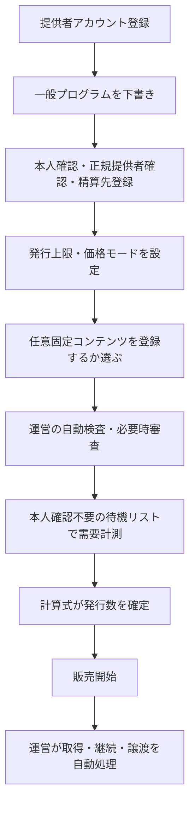

# 一般クリエイター

本ページは、認定・上級認定クリエイターが一般向けXXGGLLプログラムを作成・運用する際の
作業と責任を扱う。取得・継続・譲渡は[一般ユーザーとの関係](./relationship-general.md)、
価格・発行数は[価格・発行数の算出](./pricing.md)を正本とする。

## 基本原則

- すべてのランクで、XXGGLL取得だけではクリエイター役務を発生させない。
- クリエイターは購入者ごとの承認、返信、制作、配信、発送、更新判断を行わない。
- 運営が決済、台帳、証票生成、属性同意、通知、通報、返金を処理する。
- クリエイターの作業は、公開前の一回設定と、連絡先・権利・プログラム状態の維持に限定する。

## 公開までのフロー

提供者アカウントは一般プログラムを下書きできるが、本人確認、正規提供者確認、精算先登録を
完了するまでは公開・発行できない。認定後は一般・上級、上級認定後は最上級まで発行できる。無料証票はPublic Betaの対象外とする。

## クリエイターが決めること

| 項目 | 決定内容 |
| --- | --- |
| 対象 | クリエイター本人、ブランド、店舗等の正規な対象 |
| ランク | 自分のクリエイターランク内で公開するXXGGLLランク |
| 発行上限 | 同時に有効にできる上限 |
| 価格モード | ルールベース自動価格またはクリエイター任意価格 |
| 任意固定コンテンツ | 販売前に完成済みの素材を登録するか。登録しなくてもよい |
| 継続 | プログラム全体を継続するか終了するか |

実発行数は公開済みの計算式が上限以下で決める。クリエイターと運営は確定数を上書きしない。

## 販売後に行わないこと

- 購入申請、二次取得、更新、継続再開を個別に承認する
- 保有者ごとにメッセージ、画像、音声、動画を制作する
- 定期投稿、最低投稿回数、先行案内、割引、抽選優遇を履行する
- 個々の支援者へ返信、リアクション、既読を返す
- 本人確認書類、法的氏名、住所、連絡先を確認する
- 退出者の特定、退出理由の調査、決済失敗の督促を行う
- 二次流通の新保有者・前保有者を選ぶ

これらが必要な商品・サービスは、XXGGLLから分離した追加商品またはVIP・ExtraVIP個別サービスとして扱う
（→ [コンテンツ・追加商品・個別サービス](../benefits/templates.md)）。

## 維持作業

クリエイターまたは正規提供者が行う継続作業は次に限定する。

- 連絡先、代理権、精算先、税務情報を最新に保つ
- 登録済み素材の権利が失効・変更した場合に運営へ申告する
- アカウント侵害、なりすまし、重大な誤表示を運営へ通報する
- 運営からの重要な規約・安全確認へ30日以内に応答する
- 活動終了時にプログラム終了を申告する

集計と、owner限定の現在保有者情報の閲覧は任意であり、未閲覧を違反や評価低下として扱わない。

## 集計と現在保有者の確認

- クリエイターは受け取るプロフィール項目や開示先を設定しない。許可項目と利用者の共通共有設定は[属性開示・決済事業者確認](../foundation/identity-disclosure.md)が所有する。
- 個別通知は行わず、[ファン全体の傾向](../../app-spec/experience/creator-management/audience.md)を既定の確認画面とする。
- 集計画面に個人行、応援文、プロフィールカード、通報操作、CSVを混在させない。
- owner限定の現在保有者情報は、[発行プログラム](../../app-spec/experience/creator-management/programs.md)の一件詳細だけで読取できる。staff、他Creator、前保有者には表示しない。
- 属性・集計・限定開示を購入者の承認・拒否、差別的選別、外部営業、私的連絡へ使わない。

## 任意固定コンテンツ

販売前に完成済みの素材を1ランクにつき最大3件登録できる。登録は任意であり、販売後の更新義務は
ない。クリエイターは配信・表示・譲渡後閲覧に必要な権利を確認し、問題が生じた場合は運営へ
停止を依頼する。購入者ごとの個別制作や差し替えは行わない。

## クリエイター報酬・精算と支援者データ

クリエイター画面では、次を分けて表示する。

- 一次発行、継続支援、証票支援、二次再発行それぞれのクリエイター報酬
- 追加商品・VIP・ExtraVIP個別サービスの別契約対価
- 対象取引、確定額、精算可能日、確認中・取消し・精算済みの状態

クリエイター報酬は、購入者から直接受け取る売上や預り金ではなく、運営とのクリエイター契約に基づく支払債務である。
購入価格や運営売上との配分率は表示・約定せず、決済手数料、返金・異議申立ての見込みおよび運営上のリスク留保を
織り込んで運営が取引ごとに算定する。前保有者に付与する再発行クレジット、広告投稿等のプロモーション業務委託料、
実際の利用許諾の対価は、この報酬に含めない。

決済確定日から90日間は報酬を確認中とし、精算可能額に含めない。決済事業者・カード会社からの異議申立て、
不正利用を示す合理的な資料または公的機関からの要請がある取引は、最長180日まで確認中にできる。確認中に返金・
取消しが確定したときだけ対応する報酬を取消記帳する。購入者の申告だけで直ちに返金・取消しは行わない。精算可能額
として確定・支払済みの報酬について、通常の購入者返金・チャージバックを理由にクリエイターへ相殺・回収は行わず、
以後の負担は運営が負う。

出金申請は、精算可能額の範囲内で行う。初回申請時はStripeがホストするConnected Accountのオンボーディングで、
本人・事業者・口座の情報およびStripeのサービス契約への同意を完了する。運営は銀行口座情報や本人確認書類を
受け取らない。出金は、日本のJPY対応Stripe Connected Accountに限る。本人・口座確認またはStripe審査が
未完了の場合、出金は保留し、別送金手段は用意しない。

支援者データは、母集団、地域、最高保有ランク、確認済み支払額帯、保有期間、共有中の任意プロフィール、グッズ傾向を、抑制・coverage・基準時刻付きの集計とする。Creator ownerは、自分の
発行プログラムの現在保有者についてだけ、アカウント名、出身国・地域、当該XXGGLLの取得時購入額、共通公開中の
任意プロフィールを確認できる。staff、他Creator、前保有者への表示、横断検索・CSV出力・営業リスト化は認めない。

## 継続・終了・安全

- 一時休止機能は設けず、販売継続またはプログラム終了を選ぶ。
- クリエイターが明示終了した場合、運営が次回以降の継続支援の自動更新と新規発行を停止し、保有者へ通知する。
  支払済み期間は満了させ、証票・来歴・現在保有者に対する発行者向け開示はXXGGLL内に保持する。
- プログラム登録時に、上記の終了後の保持・表示について[クリエイター利用規約](../../creator-terms-of-service.md)への
  同意を得る。
- 運営連絡に180日応答がなく、30日の最終確認にも応答がなければ運営が終了できる。
- 違反調査、証票停止、返金、回収は運営が判断し、クリエイターへ個別対応を求めない。
- 追加商品・個別サービスの成立済み契約はXXGGLL終了と分けて精算する。

## 上級認定とVIP招待

認定クリエイターについて、取引の健全性、規約順守、権利管理、通報・返金率、重要連絡への応答を
運営が確認し、基準を満たす場合に上級認定へ設定する。コンテンツの継続履行実績は評価しない。

VIPクリエイターは申請制にしない。上級認定クリエイターが発行するXXGGLLの取引額、継続支援、
価格・証票設計、規約順守、属性情報の取扱い等を運営が総合評価し、候補へ招待を送る。
詳細は[VIPクリエイター](../vip/creator-vip.md)を正本とする。
