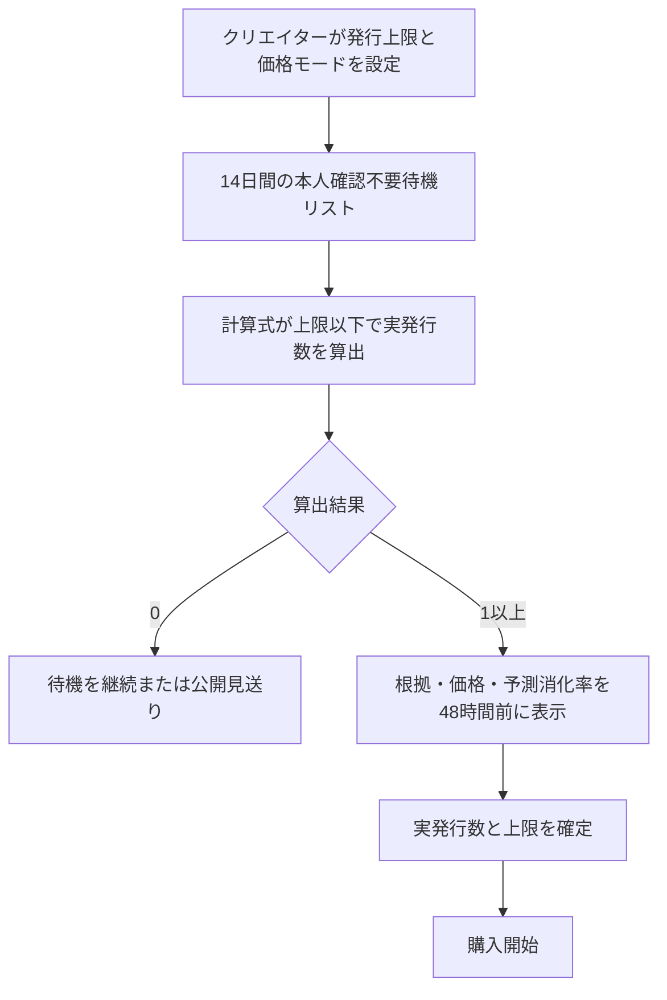

# 価格・発行数の算出

本ページは、新規発行価格と、クリエイターが設定した上限以下でルールベース算出により実発行数を決める
**価格・発行数算出ルールの正本**である。価格はクリエイター役務の対価ではなく、関係証票と
応援決済の金額として扱う。

## 適用範囲

- すべてのランクで、1ユーザーが同じクリエイターの同じランクで保有できる証票は1点とする。
- 無料XXGGLLは無料・譲渡不可とし、発行数の自動算出を行わない。
- 一般・上級・最上級・VIPは本ページの価格・発行数算出を使う。
- VIPは非公開だが、クリエイターが事前設定した受入上限内で運営が発行し、個別承認を求めない。
- VIP・ExtraVIPの個別役務価格は証票価格へ含めず、別契約で算出する。

## 価格モード

クリエイターはランクごとに次のいずれかを選ぶ。既定はルールベース自動算出とする。

| 価格モード | ルール |
| --- | --- |
| ルールベース自動算出 | 確認済み需要と成立実績を入力に、公開済みの計算式で価格を決める。クリエイター・運営の承認を挟まない |
| クリエイター任意価格 | 決済可能な最低金額以上で設定できる。計算式との差と予測消化率を警告するが、変更を強制しない |

購入画面には、価格モード、一次支援対象額、最初の12か月の継続支援額、税・手数料、
二次流通基準価格との差、「クリエイター役務を含まない」旨を表示する。

新規発行価格には最初の12か月の継続支援を含める。13か月目以降の年額継続支援は、
取得時点の新規発行基準価格の10%（決済可能な最低金額未満の場合は最低金額）に固定する。
再発行による取得では、前保有者が指定する価格ではなく、取得時点の同ランク新規発行基準価格から年額を算出する。
保有中に基準価格が変動しても年額を変更せず、譲渡成立時に新しい保有者向けの年額を再計算する。

## 自動算出価格

### 初回発行

| ランク | 初回基準 |
| --- | ---: |
| 一般 | 運営がJPYで設定し、販売前に公開する |
| 上級 | 運営がJPYで設定し、販売前に公開する |
| 最上級 | 運営がJPYで設定し、販売前に公開する |

初回基準は固定価格ではない。ルールベース算出は次の入力を使い、発売後30日以内の予測消化率80%以上を守る範囲で、
あらかじめ定義された計算式に従って価格を選ぶ。価格・金額表示・決済・台帳・精算はJPYに固定する。

- アカウント、通知先、端末、不正兆候で重複を補正した待機ユーザー数
- 待機登録時の価格感応度
- 同じクリエイターの一次発行、継続支援、二次流通実績
- 類似クリエイター・同ランクの正常な成立価格
- キャンセル、返金、不正取引率
- 発行上限と予測流動性

任意固定コンテンツの有無、制作費、将来の投稿、返信、物品、イベント、個別役務は自動算出価格の
加算要素にしない。

### 二次流通実績がある場合

- 同じクリエイター・同ランクで過去90日以内に成立した正常取引の直近5件中央値を基準価格とする。
- 再発行が成立していない申込み、関連当事者間取引、自己売買、返金、不正取引は除く。
- 有効な成立取引が3件未満なら、直前の一次価格、利用可能な成立価格、類似実績を併用する。
- 回収枠の新規発行価格は二次流通基準の90～100%とする。
- 待機需要が強ければ基準価格に近づけ、需要が弱ければ最大10%割り引く。
- 新規発行価格を二次流通基準より高く設定しない。
- 証票支援累計額は基準価格の算出式には使わない。ただし買い手に開示されるため（[二次流通](./secondary-market.md)
  の「売買画面の表示」）、実際に成立する再発行価格には影響し得る。

二次流通の再発行価格は、上記の基準価格を使って運営が決定・表示する。前保有者はその価格を承諾して
再発行を申し込むことができるが、価格設定・買い手の選択・価格交渉はできない。再発行価格の85%は、成立時に
前保有者へ再発行クレジットとして付与される（[二次流通](./secondary-market.md)）。

これにより、新規発行が二次取得者より有利な内容を持たない一方、新しい番号で来歴が短いことを
最大10%の割引として反映できる。

クリエイター任意価格が二次流通基準より10%を超えて安い場合、既存保有者への影響と予測価格差を
警告し、二段階確認後に公開する。基準価格を超える場合も、自動算出価格との差と予測消化率を警告する。

### VIP・ExtraVIP

- VIPは同じクリエイターの最上級価格、本人の過去支援帯、非公開需要を使ってルールベースで算出する。
- VIPでも価格にクリエイターの返信・面会・制作等を含めない。
- ExtraVIP証票価格はVIP価格を下限参考値とし、運営が本人の支援実績と希少性から提示する。
- VIP・ExtraVIP個別役務は証票価格に含めず、原価、拘束時間、リスク、回数を別契約で積算する。

## 発行上限と自動算出発行数

発行上限は、そのクリエイター・ランクで同時に有効にできる証票数である。クリエイターが決めるのは
発行上限だけで、実発行数は公開済みの計算式が自動決定する。

| 項目 | 確定ルール |
| --- | --- |
| クリエイター入力 | 発行上限のみ |
| 自動算出の入力 | 重複・不正補正済み待機数、価格感応度、過去の購入率、キャンセル・返金・不正率、二次流通流動性 |
| 自動算出の目標 | 30日以内の予測消化率80%以上を維持しながら予測収益を最大化 |
| 自動決定 | 算出数を最終値とし、クリエイター・運営は上書きしない |
| 需要ゼロ | 発行数0。待機継続または公開見送り |
| 事前変更 | 最初の購入前は上限を下げられる。上げる場合は14日間の需要計測をやり直す |
| 販売開始後 | 確定発行数と上限を増やさない |
| 回収枠 | 確定数内の置き換えであり純増ではない |
| 運営 | 不正需要・規約違反時に停止できるが、発行数を編集しない |

VIPはクリエイターが四半期ごとの受入上限を設定し、計算式が招待済み需要に基づきその範囲内で発行する。
クリエイターが個別ユーザーを承認する方式にはしない。ExtraVIPは個別応諾を必要とするため、
自動算出発行数の対象外とする。
