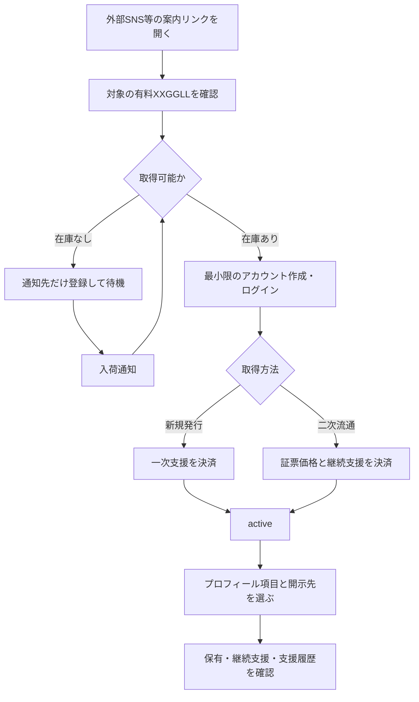

# 一般ユーザーとの関係

本ページは、一般ユーザーが一般・上級・最上級XXGGLLを取得し、属性を共有し、継続支援、
譲渡、退出するまでの体験を扱う**一般ユーザー関係性フローの正本**である。

一般ルートではクリエイターの購入承認を必要としない。XXGGLL取得だけで、クリエイターによる
制作、配信、返信、閲覧等の役務は発生しない。属性同意は
[属性開示・決済事業者確認](../foundation/identity-disclosure.md)、証票状態は
[取引ルール](./transaction-general.md)を正本とする。

## 取得から継続まで

フローを一方向の縦型にし、例外状態は取引ルールへ分離する。

- 閲覧にはアカウントを求めないが、クリエイターが外部SNS等で案内した推測困難な個別リンクの対象に限る。公開カタログ、検索、クリエイター一覧、サイトマップ登録は置かない。待機リストは通知先だけで登録できる。
- 購入には証票を保持する最小限のアカウントだけを求め、本人確認を行わない。無料証票はPublic Betaの取得導線に含めない。
- 一次購入、二次購入、継続支援、出品、属性共有にも本人確認を要求しない。
- 待機リストは需要計測と入荷通知であり、購入申請やクリエイターの承認待ちではない。
- 二次取得時、プログラム継続中なら継続支援を自動開始する。別の再開操作は求めない。
- 属性共有は任意であり、共有してもクリエイターの閲覧・返信は保証しない。

## ユーザー体験

| 段階 | ユーザーの操作・理解 | クリエイターの関与 | 記録 |
| --- | --- | --- | --- |
| 閲覧 | 外部案内のリンク先で、対象のクリエイター、ランク、価格、発行上限、役務なしの説明を確認する | なし | 閲覧だけでは関係を作らない |
| アカウント作成 | メールアドレス等の最小限の情報で証票の保有先を作る | なし | 一般ユーザーになる。本人確認は行わない |
| 取得 | 一次支援または二次取得を選ぶ | 個別承認しない | 証票と現在の保有関係を記録する |
| プロフィール・項目別開示 | 表示名、年代、地域、興味、応援理由等をプロフィールで編集し、各項目の開示先を選ぶ | ダッシュボードで集計を任意に見る | 共有先・項目・目的・同意を記録する |
| 継続 | 有料証票は定期的な応援決済を継続する | 制作・配信・返信を行わない | 継続支援額と期間を個人履歴へ加える |
| 保有表示 | 証票、バッジ、支援タイムラインを自分または選んだ公開範囲で表示する | なし | 運営が自動生成する |
| 退出 | 継続停止、譲渡、自主返還を選ぶ | 個別判断・承認をしない | 選んだ終了状態へ遷移する |

ユーザー向け画面では、「公式な支援関係の記録」であることと、「クリエイター本人の認知、返信、
推薦、面会を保証しない」ことを、取得確認画面にも表示する。

法令上の本人・年齢・資格確認が必要なコンテンツまたは役務は、本サービスで提供しない。

## 支援と支払いの表示

ユーザーには次を分けて表示する。

- 一次支援額
- 継続支援額と次回決済日
- 証票支援額（証票ごとの累計）
- 二次流通時にクリエイターへ配分されたロイヤリティ
- 二次流通の再発行価格、前保有者へ付与された再発行クレジット、クリエイター報酬
- 税、プラットフォーム手数料、決済手数料

二次流通の再発行価格のうち、前保有者へ付与される再発行クレジットを、クリエイターへの支援額やVIP招待用の
支援実績へ加算しない。

## 継続支援中の関係

- 継続支援はクリエイターコンテンツの購読料ではなく、現在の支援関係を維持する応援決済である。
- 運営は証票の現在状態、継続記念、支援履歴、プロフィール項目の開示、クリエイター向け集計を維持する。
- クリエイターへ保有者ごとのリアルタイム通知やプッシュ通知は送らない。クリエイターがダッシュボードを開いたときに集計を確認できる状態を既定とする。
- ユーザーへ既読・未読、プロフィール閲覧、返信状況を表示しない。
- 支援実績等によりVIP候補になっても自動昇格せず、運営審査と招待承諾を必要とする。

## 終わり方

| 区分 | ユーザーの選択・原因 | 証票 | 個人支援履歴・属性 |
| --- | --- | --- | --- |
| A 継続停止 | 自動更新を停止、または決済失敗後の猶予満了 | 非継続で保持。90日以内は再開・出品・返還可能 | 過去履歴を保持。現在支援者表示と属性共有を停止 |
| B 再発行 | 継続中または猶予中に二次流通の再発行を申し込む | 番号・来歴を新保有者へ引き継ぐ。前保有者へは再発行クレジットを付与 | 前保有者の履歴・属性・メッセージは移転しない |
| C 自主返還 | 対価を求めず即時退出 | 運営が回収。プログラム継続中なら新規発行枠へ戻せる | 過去履歴を保持。退出理由は外部表示しない |
| D プログラム終了 | クリエイターの終了宣言または運営による終了 | 次回以降の自動更新を止め、支払済み期限の満了後に終了済みとして期限なく保持・譲渡・放棄可能 | 新規支援と属性共有を停止。過去履歴を保持 |
| E 強制失効 | 規約違反・安全上の判断 | 運営が回収・アーカイブ | 必要な不正対策記録を保持。外部への理由表示は最小限 |

詳細な猶予期間、出品、回収、再発行は[取引ルール](./transaction-general.md)を正本とする。

## 退出の匿名性

- 譲渡時、買い手には証票番号、発行日、公開来歴を示すが、前保有者、支援額、属性、メッセージ、
  退出理由を示さない。
- 自主返還・強制失効・猶予満了で回収した枠は、プログラム継続中なら新しい番号の新規発行として戻す。
- クリエイターには退出者の個人通知を送らず、現在支援者の集計だけを更新する。
- 安全上の通報を伴う場合は、運営が調査し、クリエイターへ本人調査や直接対応を求めない。

## プログラム終了

プログラム終了時、運営は証票を一方的に回収しない。次回以降の自動更新を停止し、支払済み期間は満了まで維持する。満了後も、証票と来歴およびXXGGLL内で公開済みの
表示は終了済みの関係記録として残す。終了後の二次取得者には、
新しい支援関係が始まらず、クリエイターへの属性共有も行われないことを明示する。

終了条件は次の2つとする。

- クリエイターまたは正規提供者が終了を宣言する。
- 運営連絡に180日間応答がなく、30日の最終確認期間にも再開意思が確認できない。

役務を原則含めないため、プログラム終了だけを理由とする支払済み継続支援の返金は行わない。ただし、終了確定後の
誤決済、別商品・VIP・ExtraVIP役務は、それぞれの決済・契約条件に従って精算する。

終了後の表示・記録保持は、クリエイター利用規約への同意を前提にする。

## 支援状況の統計

- ユーザーは一次支援、継続支援、証票支援、ロイヤリティ寄与、保有期間を確認できる。
- 支援者内の順位は正確な金額ではなく、「上位10%」等の帯で本人だけに表示する。
- クリエイターには現在支援者数、ランク別人数、支援額帯、継続期間、同意済み属性の集計を表示する。
- クリエイターが個人支援者を選別、承認、営業する用途には使わない。
- 退出理由と前保有者を特定できる履歴は統計へ表示しない。
