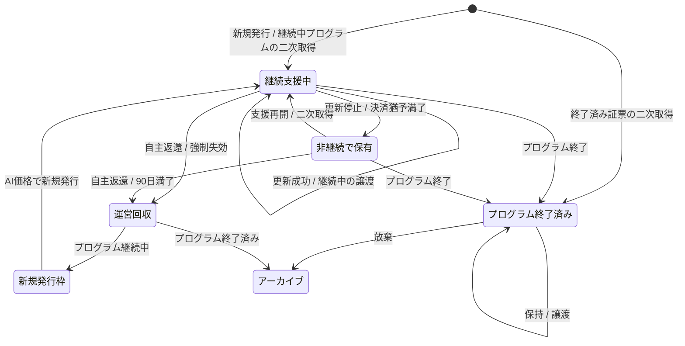

# 取引ルール

本ページは、XXGGLL証票の在庫、決済、継続支援、状態遷移、回収に関する
**取引ルールの正本**である。価格と発行数は[価格・発行数の算出](./pricing.md)、
属性共有は[属性開示・決済事業者確認](../foundation/identity-disclosure.md)を正本とする。

## 適用範囲

- すべてのランクで、1ユーザーが同じクリエイターの同じランクで保有できる証票は1点とする。
- 無料証票は譲渡・二次流通・継続支援を行わない。
- 無料証票とExtraVIP証票は証票支援の対象外とする（[関係記録・コンテンツ](../benefits/content.md)の「証票支援」）。
- 一般・上級・最上級は公開在庫、新規発行、継続支援、二次流通の対象とする。
- VIPは非公開在庫だが、取得後の継続支援と状態遷移は一般ルールを使う。
- VIP・ExtraVIP証票の状態遷移は一般ルールを使い、個別役務の決済・履行は証票から分離する。

## 不変条件

- 無料取得、待機、一次購入、二次購入、継続支援、出品に本人確認を要求しない。
- すべてのランクで、証票の取得・継続支援だけではクリエイター役務を発生させない。
- VIP・ExtraVIP役務は、証票と分離した個別契約・別決済が成立した場合だけ発生する。
- 証票記録は譲渡できるが、個人支援記録、属性、メッセージ、本人確認情報は譲渡しない。
- 二次流通価格の全額をクリエイターへの支援額として扱わない。
- 同時に有効な証票数は確定発行数を超えない。

## 証票の状態

個人支援記録と属性共有は証票状態から分離する。再発行成立時に前保有者の現在属性共有を終了し、
新保有者の支援期間と属性選択を新しく開始する。

## 取得・決済

| 場面 | ルール |
| --- | --- |
| 購入資格 | 最小限のアカウント、有効な決済手段、同じクリエイター・同じランクの証票を保有していないことだけを確認する。本人確認、法的氏名、住所の登録を購入条件にしない |
| 購入経路 | 新規発行と二次流通を同じ一覧・購入画面で扱い、クリエイター承認を挟まない |
| 在庫仮押さえ | 決済開始から15分間。失敗・中断時は自動解放し、同じ画面から再試行できる |
| 待機リスト | メールアドレス等の通知先だけで登録可能。新規発行・二次再発行の両方を通知する。登録順は購入優先権を保証しない |
| 一次取得 | 証票価格に最初の12か月の継続支援を含め、13か月目以降の年額、税・手数料を表示する。決済成立後に新しい番号を発行する |
| 二次取得 | 運営が決定した再発行価格、前保有者へ付与する再発行クレジット、クリエイター報酬、取得時点の新規発行基準から算出した年額継続支援、税・手数料を分けて表示する |
| 終了済み取得 | 終了済み表示を確認した買い手だけ取得可能。継続支援と属性共有は開始しない |

「応援決済」は仕様上の仮称である。売買・役務・寄附等の法的な表示区分は、実装前の法務レビューで
確定する。

## 継続支援

- 有料証票は年単位の自動継続を既定とし、新規発行価格には最初の12か月を含める。取得時に
  支払済み期限、次回決済日、13か月目以降の年額を表示する。
- 購入者は、XXGGLLのWebアプリで[利用規約](../../terms-of-service.md)を確認し、最終確認画面の同意チェックを
  自ら選択したうえで購入を確定する。同画面には、初回の支払済み期限、次回決済日・年額、自動更新、停止期限、
  停止画面への導線を表示する。
- 継続支援はクリエイターコンテンツの購読料ではない。現在の支援関係、保有表示、属性共有、
  支援履歴を運営が維持するための応援決済である。
- 継続中証票を二次取得した場合、既存の支払済み期限を引き継ぎ、次回更新から新保有者へ課金する。
  年額は前保有者が指定する価格ではなく、取得時点の同ランク新規発行基準価格の10%で再計算する。
- 非継続証票をプログラム継続中に二次取得した場合、取得決済時に年額継続支援の12か月分を課金し、
  その場で継続支援中へ戻す。買い手による再開操作は不要とする。
- 決済失敗時は7日間の再試行猶予を設け、運営が自動再試行と通知を行う。クリエイターへ通知しない。
- 7日以内に成功しなければ非継続へ移し、現在支援者表示と属性共有を停止する。
- ユーザーはWebアプリの保有証票詳細から、支払済み期限、次回決済日、年額、自動更新の状態をいつでも確認できる。
  次回更新日の24時間前まで自動継続を停止でき、停止後も支払済み期限までは現在の状態を維持し、その後は
  非継続へ移す。自主返還も同じ画面から行える。

## 支払いの記録

一次発行、継続支援および証票支援では、購入者との売買・役務提供の当事者および代金受領者は運営とする。
運営は受領額を売上として計上し、クリエイターには別途のクリエイター契約に基づく**クリエイター報酬**を支払う。
この報酬は購入者からの預り金・送金ではなく、また広告投稿を委託する対価ではない。広告投稿等を個別に委託する場合の
プロモーション業務委託料、実際の利用許諾の対価は、クリエイター報酬と分けて定める。

二次流通では、運営が新保有者へ証票を再発行し、再発行価格を受領する。前保有者には再発行価格の85%に相当する
再発行クレジットを付与する。これは現金・預り金・送金ではない。再発行クレジットは、運営が契約相手となる
一次発行・再発行・継続支援への利用に限り、付与日から6か月で失効する。クリエイターには、別契約に
基づくクリエイター報酬を現金精算の対象とする。
再発行クレジット自体は返金・チャージバックの対象にせず、再発行の購入決済自体が取消・返金・チャージバックにより
成立しなくなった場合だけ、対応するクレジット付与を取り消す。前保有者へ現金または送金可能残高を渡す処理はない。

### クリエイター報酬と精算

クリエイター報酬は、運営とクリエイターとの契約に基づき運営が負う支払債務である。購入者はその契約の
当事者ではなく、購入者の支払いをクリエイターへ取り次ぐものでもない。対象は一次発行、継続支援、証票支援および
二次再発行とし、報酬額は購入価格・運営売上・これらの割合と一致することを約定しない。決済手数料、返金・
異議申立ての見込みおよび運営上のリスク留保を織り込んで、運営が取引ごとに算定する。決済が確定した時点で運営が
`ledger_entry`に報酬額と精算可能日を記帳し、返金・取消時は同じ取引を参照する取消行を追加する。未確定決済、
取消済み決済および前保有者の再発行クレジットは報酬に含めない。

S1別商品・S2 VIP・ExtraVIP役務のクリエイター対価は、それぞれの別商品・個別役務契約に基づく対価であり、
XXGGLL本体のクリエイター報酬とは区別する。ただし、実際の送金には同じStripe Connected Accountを利用できる。
広告投稿その他のプロモーション業務を別途委託する場合の業務委託料も、いずれとも別契約・別記帳とする。

精算可能額は、クリエイターごとの精算可能日を過ぎた有効な報酬・別契約対価の累計から、返金取消額および申請済み・
処理中・支払済みの出金申請額を控除して算出する。通常の報酬の精算可能日は決済確定日から90日後とする。決済事業者・
カード会社からの異議申立て、不正利用を示す合理的な資料または公的機関からの要請がある取引は、最長180日まで
精算可能額への計上を保留できる。購入者の申告だけで直ちに返金・報酬取消しは行わない。クリエイターは精算可能額の
範囲で任意の時点に出金を申請できるが、Stripe Connected
Accountの本人確認、口座確認および送金可否がすべて有効になるまでは送金を実行しない。海外クリエイターも
対象国・通貨・サービス契約および国境をまたぐ送金経路がStripeで有効な場合に限り、同じ方法で受け取れる。
対象外の国・通貨またはStripeの審査未完了に対して、運営は代替の銀行送金を行わない。

| 決済項目 | クリエイターへの支払 | 個人支援実績 | 証票の取得原価 |
| --- | --- | --- | --- |
| 一次発行 | クリエイター報酬（取引ごとに算定） | 報酬額を加算 | 加算する |
| 継続支援 | クリエイター報酬（取引ごとに算定） | 報酬額を加算 | 加算しない |
| 証票支援 | クリエイター報酬（取引ごとに算定） | 報酬額を加算 | 加算しない（証票側の証票支援累計額へは別途加算する） |
| 二次流通 | 再発行クレジットおよびクリエイター報酬（いずれも運営が取引ごとに算定） | クリエイター報酬だけ加算 | 新保有者の再発行価格を加算 |
| S1別商品 | 別商品契約に定める対価 | XXGGLL支援実績へ加算しない | 証票原価へ加算しない |
| S2 VIP・ExtraVIP役務 | 個別役務契約に定める対価 | XXGGLL支援実績へ加算しない | 証票原価へ加算しない |

決済事業者手数料、返金・チャージバックに備える運営上のリスク留保は、クリエイター報酬の算定に織り込み、
確定・支払済みの報酬から別途差し引かない。税、源泉徴収、返金、チャージバックは法令・決済条件に従って別明細とする。
確認期間中に返金・取消しが確定したときは対応する報酬を取消記帳する。精算可能額として確定・支払済みの報酬について、
通常の購入者返金・チャージバックを理由にクリエイターへ相殺・回収は行わず、その後の負担は運営が負う。

## 非継続時

- 非継続移行から90日間は、継続支援の再開、二次再発行の申込み、自主返還を選べる。
- 90日間に1回、最長30日間出品できる。出品中は90日の残日数を停止する。
- 期限内に何も選ばなければ運営が回収する。
- 過去の個人支援履歴はアカウントへ保持するが、現在支援者としての表示・属性共有は停止する。
- 継続支援を再開した場合、停止前の支援期間と再開後の期間を分けて記録し、連続期間と誤表示しない。

## 調査・違反

- 違反調査中は譲渡、継続決済、属性共有、公開表示、任意固定コンテンツ閲覧を停止する。
- 自主返還と運営への通報は常に許可する。
- 違反なしなら直ちに復帰し、支払済み期間を停止日数分延長する。
- 違反ありなら強制失効し、必要な不正対策記録を保持する。
- クリエイターに調査、本人特定、返金判断、違反者との直接連絡を求めない。

## 回収と再発行

自主返還、強制失効、90日満了で回収した証票は、プログラム継続中なら新規発行1枠へ戻す。

- 回収済み番号を再利用しない。
- 新しい番号と新しい証票来歴で発行する。
- AIが新規発行価格を再算出する。
- 回収理由と前保有者を新規購入者・クリエイターへ表示しない。
- 同時に有効な数はAI確定発行数を超えない。
- 終了済み証票はアーカイブし、再発行しない。

## プログラム終了

プログラム終了は、以後の自動更新を終了することであり、XXGGLLの証票・来歴・公開済みの表示を削除することではない。
終了確定時刻以後は、新規発行、待機リスト、次回以降の継続決済、属性共有を停止する。

- 未確定の一次決済と継続決済は取消・返金する。
- すでに支払済みの継続期間は支払済み期限まで満了させ、プログラム終了だけを理由に日割り返金しない。満了時に
  証票を終了済みへ移す。
- 出品中の証票は、支払済み期限満了後に終了済みへ変更する。買い手が24時間以内に再確認した場合だけ成立させる。
- 終了済み証票は期限なく保持・二次流通・放棄できる。
- 終了後の二次取得では継続支援と属性共有を開始しない。
- 放棄した終了済み証票はアーカイブし、再発行しない。
- S1別商品とS2 VIP・ExtraVIP役務は、証票終了とは分けて各契約条件で精算する。

クリエイターは、[クリエイター利用規約](../../creator-terms-of-service.md)で、プログラム終了後もXXGGLL内に
残る証票、来歴、公開済みの表示を利用者が閲覧できることに同意する。権利侵害、安全上の理由または法令上の必要が
ある場合だけ、運営は対象の表示・コンテンツを停止または削除できる。

### 公開前の実装確認

最終確認画面と利用規約に、上記の自動更新・停止・プログラム終了の表示を反映し、公開前に
[画面・コンソール構成](../../app-spec/screens.md)および[利用規約](../../terms-of-service.md)との一致を確認する。
