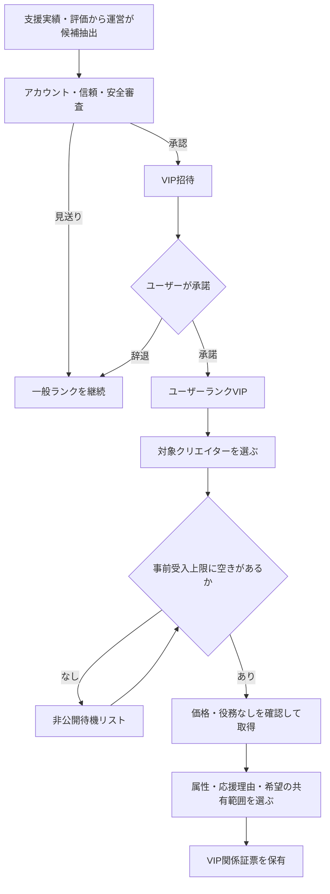
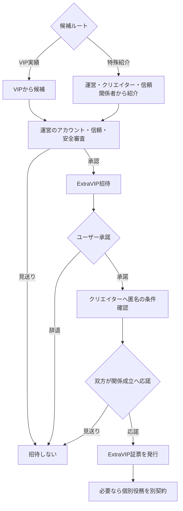

# VIP・ExtraVIPユーザーとの関係

本ページは、一般ルートに対するVIP・ExtraVIP固有の差分を扱う。証票、継続支援、
個人支援履歴の基本は一般ルートを適用する。

## VIPとExtraVIPの境界

| 項目 | VIP | ExtraVIP |
| --- | --- | --- |
| 到達 | 支援実績またはクリエイター評価等を運営が審査して招待 | VIP実績または特殊紹介を起点に運営が審査して招待 |
| 公開 | 非公開 | 非公開 |
| 証票発行 | クリエイターの事前受入上限内で運営が処理 | ユーザー・クリエイター双方の個別応諾後 |
| 属性共有 | コンシェルジュ経由で詳しいプロフィール・希望を共有 | 必要項目を個別確認して共有 |
| クリエイター役務 | 個別契約へ双方が合意した範囲だけ発生 | 個別契約へ双方が合意した範囲だけ発生 |
| 譲渡 | VIPユーザー間の非公開市場で可能。クリエイター承認不要 | 譲渡不可 |

VIP・ExtraVIP証票を取得しても、それだけではクリエイター本人による閲覧、返信、推薦、面会、
制作、サービス提供は保証しない。役務は証票取得後に、双方が条件へ応諾し、別契約・別決済が
成立した場合だけ発生する。

VIP・ExtraVIPへの招待、XXGGLLの取得、役務相談の開始にKYCを要求しない。KYCは、個別契約の
対象コンテンツ・役務を開示・利用するため法的に必要な場合だけ、利用直前に実施する。

## VIPフロー

クリエイターはVIP候補者や購入者を一人ずつ承認しない。運営が招待、受入上限、決済、
属性同意を管理する。クリエイターは四半期ごとの受入上限と受け取る属性カテゴリを
事前設定する。

## VIP招待基準

運営は次を総合評価し、自動昇格ではなく人手承認後に招待する。

- 一次支援額、継続支援額、証票支援額、二次流通ロイヤリティへの寄与
- 支援期間と複数クリエイターでの健全な利用
- 決済、通報、規約順守
- クリエイターから運営へ寄せられた評価
- 属性共有やメッセージでの安全な振る舞い

二次流通で前保有者へ付与した再発行クレジットは、支援実績に加算しない。招待理由の詳細な内部スコアは
公開しないが、ユーザーには「支援実績」「クリエイター評価」「運営信頼確認」等の理由区分を示す。

## ExtraVIPフロー

ExtraVIPはVIPの単純な上位購入ランクではなく、個別の信頼関係を前提とする特殊区分である。

特殊紹介は審査開始の契機であり、資格を保証しない。紹介者、紹介理由、審査担当者、判断結果を
非公開の運営記録へ残す。支出額、著名性、紹介者の地位だけではExtraVIPにしない。

ExtraVIP証票は個別関係に紐づくため譲渡できない。ユーザーが終了する場合は証票を終了済みの
個人記録として保持するか、本人の希望で非公開アーカイブする。別のユーザーへの枠移転は、
新しい審査と双方合意によって新しい番号を発行して行う。

## 属性・希望の共有

VIP・ExtraVIPユーザーは専用スレッドで、次を運営へ伝えられる。

- 共有したいプロフィール属性
- 応援理由、関心、活動歴
- クリエイターへ知ってほしいこと
- 避けたい内容、連絡手段、時間帯
- VIP・ExtraVIPで検討したい個別役務の条件

通常の属性・希望共有は、実現、返信、閲覧を保証しない。運営はユーザーの同意後、
クリエイターの受入設定に合う項目だけをダッシュボードの集計表示へ含める。役務を希望する場合は、
VIP・ExtraVIPのどちらも通常共有から分離した個別契約フローへ進む。

VIP・ExtraVIP役務では、匿名の実現可能性確認、共有項目の再同意、最終条件への双方応諾、
必要時の条件付きKYC、別決済を経て契約を成立させる。詳細は
[VIPコンシェルジュ運用](./vip-concierge.md)と
[任意提供・個別役務](../benefits/templates.md)を正本とする。

## 継続・譲渡・終了

- VIPの継続支援と決済失敗は一般ルールを使う。
- VIP非継続証票をVIPユーザーが二次取得し、プログラム継続中なら取得時に継続支援を自動再開する。
- VIP譲渡では運営が買い手のVIP資格を自動確認し、クリエイターへ個別承認を求めない。
- 譲渡時、前保有者の属性、希望、メッセージ、支援履歴を買い手へ移転しない。
- ExtraVIPは譲渡不可とし、終了・再開・別クリエイターとの関係は運営が個別に扱う。
- プログラム終了後は新規支援と属性共有を停止し、証票を終了済み関係記録として保持する。

## 一般ユーザーとの差分

| 項目 | 一般 | VIP | ExtraVIP |
| --- | --- | --- | --- |
| 参加 | アカウント作成後に公開在庫を取得 | 運営招待 | 運営招待と双方合意 |
| クリエイター承認 | 不要 | 不要 | 発行前に必要 |
| 属性共有 | 標準項目 | 詳細項目とコンシェルジュ | 個別に必要範囲を確認 |
| 役務 | XXGGLLには付属しない | 個別契約時だけ | 個別契約時だけ |
| 市場 | 公開二次流通 | VIP限定の非公開二次流通 | 譲渡不可 |
