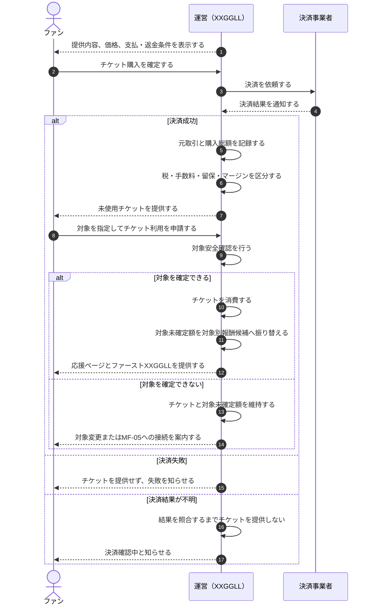
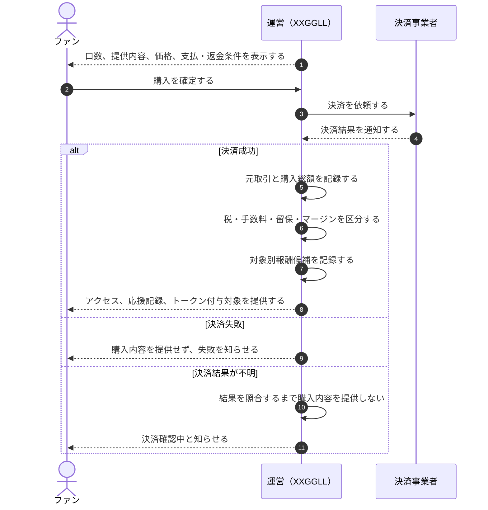
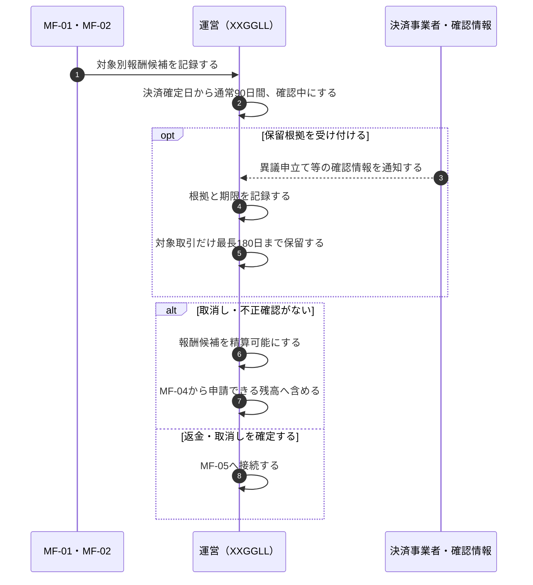
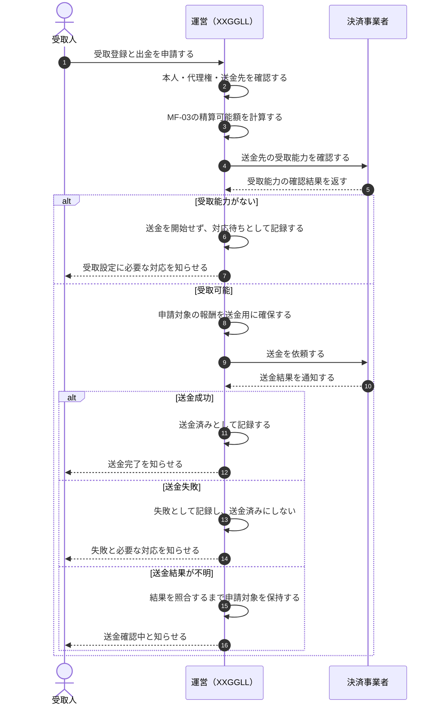
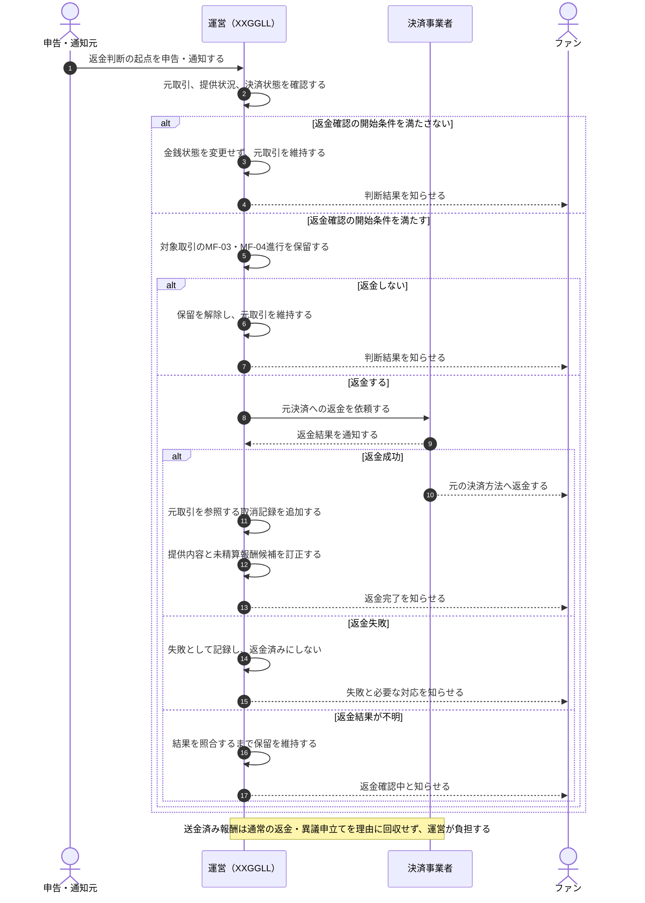

# 金銭の流れと精算

このページは、金銭の移動、留保、精算可能化、送金、取消しに関するフローだけを整理する。
各`MF` IDは、後続の仕様決定、リスク評価、実装Issue、テストから参照する固定IDとする。既存IDは改番せず、独立した金銭フローが増えた場合は新しいIDを追加する。

商品・算定・運用の未決事項は各フローの「後続仕様・リスク評価の論点」で扱い、法務確認が必要な項目は[法務チェックリスト](./legal-checklist.md)で管理する。
各フローの論点が未決定の間は、対応する販売、精算可能化、送金を有効にしない。
金銭状態を変えない画面表示、対象者との関係、コンテンツ、ランク等はこのページの対象外とする。

## 金銭フロー一覧

| ID | フロー | 開始 | 到達状態 | 正本 |
| --- | --- | --- | --- | --- |
| MF-01 | 有償リクエストチケットの購入と対象別報酬候補への振替 | ファンがチケット購入を確定する | チケットを提供し、対象確定後に報酬候補へ振り替える。または不成立・結果確認中として提供を止める | [取引・不正・利用者安全](../app-spec/security/transactions-and-safety.md)、[コントロール](../app-spec/core/controls.md) |
| MF-02 | ノーマルXXGGLLの購入 | ファンが購入を確定する | 購入内容と報酬候補を記録する。または不成立・結果確認中として提供を止める | [取引・不正・利用者安全](../app-spec/security/transactions-and-safety.md)、[コントロール](../app-spec/core/controls.md) |
| MF-03 | 報酬候補の確認と精算可能化 | 対象別報酬候補を記録する | 精算可能にする。または返金・取消しへ接続する | [クリエイター報酬・精算](../app-spec/operations/creator-settlement.md)、[取引・不正・利用者安全](../app-spec/security/transactions-and-safety.md) |
| MF-04 | クリエイター報酬の送金 | 受取人が受取登録と出金を申請する | 送金結果を確定する。または受取能力不足・失敗・結果不明として保持する | [クリエイター報酬・精算](../app-spec/operations/creator-settlement.md)、[コントロール](../app-spec/core/controls.md) |
| MF-05 | 返金・取消し | 返金判断の起点を受け付ける | 返金と取消しを確定する、元取引を維持する、または失敗・結果確認中として保留する | [取引・不正・利用者安全](../app-spec/security/transactions-and-safety.md)、[コントロール](../app-spec/core/controls.md) |

## MF-01 有償リクエストチケットの購入と振替

### 後続仕様・リスク評価の論点

- 購入要求の重複、決済結果不明、再試行時にチケットと課金を二重に作らない条件
- 対象未確定額の会計上の扱い、チケット利用期限、期限到来時の返金・失効
- 対象変更を許す回数と範囲、対象を確定できない場合にMF-05へ接続する条件
- 税、決済手数料、留保、運営マージン、報酬候補への振替順序と端数処理

## MF-02 ノーマルXXGGLLの購入

### 後続仕様・リスク評価の論点

- 購入要求の重複、決済結果不明、再試行時に課金・提供・報酬候補を二重に作らない条件
- 口数、購入上限、有効期間、追加購入と、取引確定時に固定する提供内容
- 税、決済手数料、留保、運営マージン、報酬候補への配分順序と端数処理
- MF-05で返金・取消しが確定した場合のアクセス、応援記録、トークンの訂正範囲

## MF-03 報酬候補の確認と精算可能化

### 後続仕様・リスク評価の論点

- 90日と180日の起算点、保留を開始・解除できる根拠、操作権限、必要な証跡
- 180日到来時に確認が終わらない取引の安全側の扱い
- 同じ取引を精算可能化とMF-05の取消しへ同時に進めない排他条件
- 確認対象の集中時に、一人運営で処理できる件数、期限管理、通知・エスカレーション

## MF-04 クリエイター報酬の送金

### 後続仕様・リスク評価の論点

- 本人・代理権・送金先・受取能力の確認方法、複数の受取申請が競合した場合の一意確定
- 最低出金額、送金手数料、申請上限、未請求報酬の期限
- 同じ精算可能額への並行申請、送金依頼の再送、結果不明時の二重送金防止
- 送金失敗時に申請対象を保持・解除する条件と、決済事業者への照合手順

## MF-05 返金・取消し

個別の返金理由と判断条件はこのフローで分岐させず、共通する金銭処理だけを扱う。

### 後続仕様・リスク評価の論点

- 返金判断の権限、法令・規約上の条件、全額・一部返金と購入者への説明
- MF-03の精算可能化、MF-04の送金予約・送金処理と競合した場合の優先順位
- 返金失敗・結果不明時の再試行条件、元決済との照合、二重返金防止
- 提供内容、アクセス、トークン、未精算報酬候補の訂正範囲と順序
- 送金済み報酬を回収しない場合の運営残高、留保額、チャージバック損失の上限

## Review response

| 項目 | 結果 |
| --- | --- |
| 対象 | MF-01からMF-05の開始・到達状態、成功・失敗・結果不明、フロー間接続、精算・取引安全・コントロールの正本 |
| 初回判定 | Revise。MF-05にP1が1件、MF-04にP1が1件、安全な暫定状態にP2が1件あった |
| MF-05・対応 | 申告だけで精算・送金を保留していたため、正本に合わせて返金確認の開始条件を満たす場合だけ金銭状態を保留するゲートを追加した |
| MF-04・対応 | 送金前の決済事業者側の受取能力確認が抜けていたため、報酬確保より先に確認し、受取能力がなければ送金を開始しない分岐を追加した |
| 暫定状態・対応 | 未決論点が残るフローは、対応する販売、精算可能化、送金を有効にしないと明記した |
| 修正後判定 | No unresolved P0/P1 findings |
| 確認 | 重複決済、決済結果不明、対象未確定額、90日・180日の保留、精算と取消しの競合、受取人競合、送金能力、送金・返金の失敗と結果不明、送金済み報酬の返金負担 |
