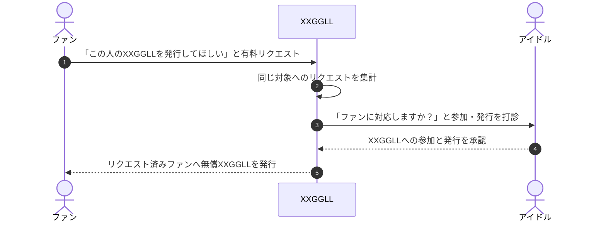
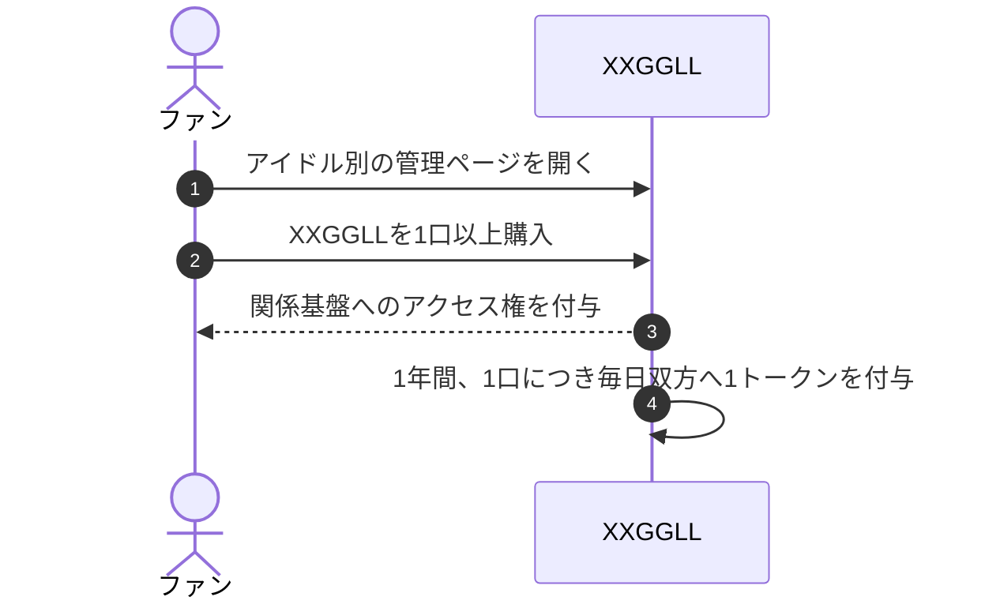

# あの子の最初のファンになりたい

> まだ誰も気づいていない「あの子」を、私はもう応援していた。

XXGGLLは、ファンの「この人を応援したい」から始まる関係基盤である。
まだXXGGLLが発行されていないアイドルでは、ファンが有料リクエストを送り、
XXGGLLが本人へ参加を打診する。すでに発行されているアイドルでは、
ファンはアイドル別の管理ページからXXGGLLを購入して関係基盤へ入る。

XXGGLLが残すのは、本人からの個人的な認知ではない。
ファンが費用と時間をかけて応援を選び、その関係を続けた事実である。

ここでいう「最初のファン」は、世界で最初にその人を応援したことを保証する表現ではない。
XXGGLLの中で早い段階から意思を示し、関係を育て始めたことを表す。

## ファンから始まる

これまでの構想では、クリエイターが自らXXGGLLを発行することから始まった。
新コンセプトでは、ファンが「あの子のXXGGLLを発行してほしい」と声を上げることから始まる。

| 観点 | 新コンセプト |
| --- | --- |
| 発行がない場合 | ファンがXXGGLLへ有料リクエストを送り、XXGGLLが同じ対象への声を集計する |
| 発行がない場合の本人の判断 | アイドルが、ファンとの関係基盤をXXGGLL上に開くかを承認する |
| 発行済みの場合 | ファンがアイドル別の管理ページからXXGGLLを購入する |
| ファンの証明 | 発行前から声を上げたこと、または購入後に時間を重ねたこと |

SNSのフォローは、関心を示すための軽くて優れた仕組みである。
XXGGLLはその代わりではなく、フォローより一段高いハードルを越えて応援を選んだ事実を残す。

## 誰のためのものか

| 主体 | 得るもの | 求められないこと |
| --- | --- | --- |
| ファン | 応援を始めた時点と、続けた時間の記録。関係基盤へのアクセスと自分のランク | 本人からの返信、認知、発行を強制しない |
| アイドル | 自分を応援するファンの意思が積み上がる関係基盤と、自分のランク | ファンごとの返信、投稿、配信、制作、発送、面会、個別承認 |
| XXGGLL | リクエスト、集計、参加確認、購入、記録、トークン、ランク、報酬を運営する | ファンとアイドルの私的な連絡や親密さを約束しない |

ファンランクは、その人が誰かを応援し続けた蓄積を示す。
アイドルランクは、その人のXXGGLLにファンの意思が積み上がった蓄積を示す。
いずれも人気、人格、実力、将来価値、本人からの認知を保証する評価ではない。

## 発行がないアイドルのコア体験

図中の「ファンに対応しますか？」は、アイドルへ個別返信や制作を求める意味ではない。
XXGGLLの参加条件を確認し、運営が提供する関係基盤をファンへ開く意思があるかを尋ねる。

無償XXGGLLに関係基盤へのアクセス権やトークン付与を含めるかは、
[未決事項・公開条件](./open-decisions.md)で決める。

## 発行済みのアイドルのコア体験

## 発行済みのXXGGLLを持つ

ファンは、発行済みのアイドルのXXGGLLをアイドル別の管理ページから複数口購入できる。
価格は**1口1,000円（仮）**とする。

1口は、アイドルの個別サービスを1回受ける権利ではない。
XXGGLLが提供する関係基盤へのアクセス権であると同時に、
ファンとアイドル双方のランクを上げるトークンを1年間生み出す単位である。

複数口を購入すると、アクセスできる役務が増えるのではなく、毎日のトークン取得量が増える。
口数によってアイドルの返信、認知、接触、コンテンツ、物品、抽選当選を約束しない。

## 時間がランクになる

購入された各口は、購入を起点とする1年間、毎日トークンを付与する。

| 付与先 | 1口あたりの毎日の付与 | 複数口の場合 |
| --- | ---: | ---: |
| 購入したファン | 1トークン | 有効口数と同じ数を毎日付与 |
| 対象アイドルのXXGGLL | 1トークン | 全ファンの有効口数の合計と同じ数を毎日付与 |

たとえば、1人のファンが同じアイドルのXXGGLLを3口購入した場合、
1年間、ファンには毎日3トークン、そのアイドルのXXGGLLにも毎日3トークンが付与される。

- ファンランクは、1つのファンアカウントが全アイドルのXXGGLLから得たファントークンの累積量で決まる。
- アイドルランクは、1人のアイドルのXXGGLLへ全ファンから付与されたアイドルトークンの累積量で決まる。
- トークンは時間の経過に応じて付与し、購入時に1年分を一括付与しない。
- トークンは決済手段、値引き、換金、払戻し、送金、譲渡、投資、配当、利息には使えない。

XXGGLLは、費用を払ったことだけを競うための仕組みではない。
いつから関心を持ち、どれだけ継続したかを、ファンとアイドルの双方へ毎日積み上がる記録に変える。

## 変えない原則

1. **アイドルへ直接役務を発生させない**  
   XXGGLLの取得だけでは、返信、制作、投稿、配信、発送、面会その他の役務は発生しない。

2. **XXGGLLが関係を運営する**  
   需要集計、連絡、購入、記録、トークン、ランク、報酬、通知、安全対応はXXGGLLの責任で行う。

3. **本人の意思なしに発行しない**  
   ファンのリクエストが集まっても、アイドルが承認するまでは本人公認のXXGGLLとして発行しない。

4. **お金で本人の認知を買えると表現しない**  
   費用と口数は応援意思と関係の蓄積を表す。本人からの反応や親密さの対価にはしない。

詳しい公開条件、対象者保護、決済・報酬、トークン訂正、ランク設計、既存仕様との移行は
[未決事項・公開条件](./open-decisions.md)で扱う。
