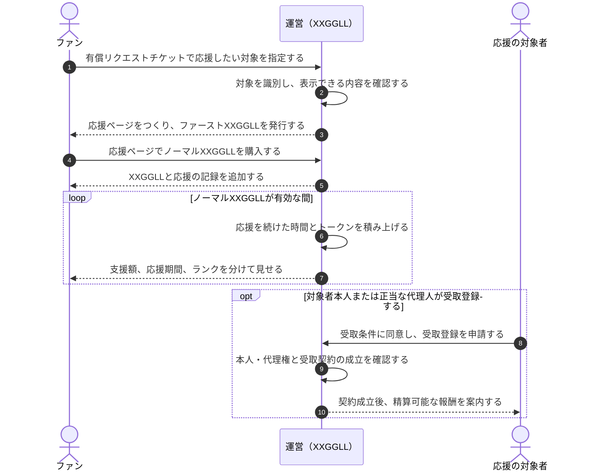

# 基本コンセプト

> まだ誰も気づいていない「あの子」を、私はもう応援していた。

XXGGLLは、ファンが最初に置いた応援の意思を、自分で続けられる記録に変える基盤である。
応援ページとXXGGLLを通じて、早い段階で見つけたこと、その後に支援したこと、応援を続けた時間を振り返れるようにする。

ここでいう「最初のファン」は、世界で最初にその人を応援したことを保証する表現ではない。
XXGGLLの中で早い段階から意思を示し、応援を育て始めたことを表す。

## コア体験

金銭が動く各処理は[金銭の流れ](./money-flow.md)、XXGGLLとランクに使う非金銭データは[XXGGLLのランクシステム](./xxggll-and-ranks.md)で分けて扱う。

## 利用するページ

| ページ | 利用者 | 体験 |
| --- | --- | --- |
| 応援ページ | ファン | 応援する対象と自分の関係を確認し、ノーマルXXGGLLを追加する。 |
| 自分の記録 | ファン | 保有するXXGGLL、応援を始めた時点、継続期間、トークン、ランクを振り返る。 |
| 報酬受取ページ | 対象者本人または正当な代理人 | 任意で受取条件へ同意し、契約成立後に精算可能な報酬と送金状況を確認する。 |

応援ページは、対象者の公式・公認ページではない。対象者の返信、投稿、配信、制作、発送、面会その他の個別対応を、XXGGLLの発行や購入の見返りにしない。

## ファンが残せるもの

- XXGGLLの中で応援を始めた時点
- ファースト／ノーマルXXGGLLの取得と訂正の履歴
- 金銭による支援の履歴
- 応援を続けた期間
- 継続によって積み上がるトークンとランク

支援額、応援期間、ランクは別の尺度である。合算した単一の「応援の強さ」や対象者からの認知・親密さとして表示しない。

## 変えない原則

1. **アイドルへ直接役務を発生させない**
   XXGGLLの取得は、返信、制作、投稿、配信、発送、面会その他の役務を要求しない。

2. **対象者の承認・公認を示さない**
   発行、購入、応援ページの公開は対象者の承認を条件にしない。対象者が認知、賛同、公認しているようにも表示しない。

3. **お金で対象者の認知を買えると表現しない**
   費用や口数は応援の記録と関係の蓄積を表す。対象者からの反応や親密さの対価にはしない。

4. **金銭と時間を混ぜない**
   支援額と応援期間は別々の記録として扱い、どちらか一方をもう一方で置き換えない。

5. **訂正しても来歴を消さない**
   取消しや誤りがあったときは、過去の表示を黙って書き換えず、訂正が分かる形で現在の状態へ反映する。

6. **確認できない外部実績を価値に変えない**
   フォロワー数、イベント参加、グッズ購入などは、取得元、確認方法、訂正方法、公開範囲が決まるまで記録やランクに使わない。

## コンセプトを具体化するページ

1. 基本コンセプト（このページ）
2. [金銭の流れ](./money-flow.md)
3. [XXGGLLのランクシステム](./xxggll-and-ranks.md)
4. [法務チェックリスト](./legal-checklist.md)

## Review response

| 項目 | 結果 |
| --- | --- |
| 対象 | 基本コンセプトへの統合、4ページの責務、金銭フロー、ランクと非金銭データ、法務ゲート |
| 初回判定 | Revise。基本シーケンスとランクの対象にP1が1件、正本で確定した売主の扱いにP1が1件、応援期間の起算点と肖像利用の根拠にP2が各1件あった |
| ランク・対応 | 基本シーケンスのトークン付与対象をノーマルXXGGLLに限定し、未決定のファーストXXGGLLへ自動付与する読み方を除いた |
| 正本・対応 | 法務チェックリストで契約当事者を白紙に戻さず、運営を売主・代金受領者とする正本を出発点に、新商品への適用を確認する形へ修正した |
| UXデータ・対応 | 応援期間の起算点を確定仕様にせず、起算・中断・再開が決まるまで日数を公開しない境界へ統一した |
| 法務根拠・対応 | 著作権資料に加え、顔写真と肖像権に関する文化庁資料を確認先へ追加した |
| 修正後判定 | No unresolved P0/P1 findings |
