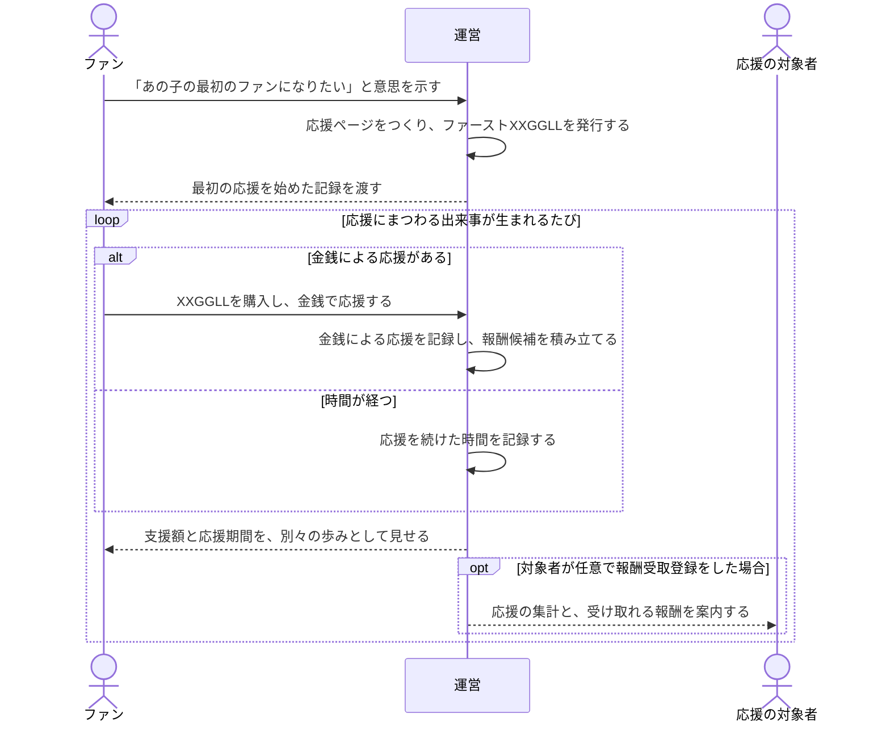

# あの子の最初のファンになりたい

> まだ誰も気づいていない「あの子」を、私はもう応援していた。

XXGGLLは、ファンが最初に置いた応援の意思を、自分で続けられる記録に変える基盤である。
対象者の承認、返信、発信を待たずに始められ、金銭による応援と応援を続けた時間を混ぜずに残す。

ここでいう「最初のファン」は、世界で最初にその人を応援したことを保証する表現ではない。
XXGGLLの中で早い段階から意思を示し、応援を育て始めたことを表す。

## コア体験

### ファンにとって

ただフォローするだけでなく、早い段階で見つけ、応援を始めた事実が残る。
初めて参加した時点と、その後の応援の来歴を、後から振り返れる。
どれだけ支援したかと、どれだけ長く応援してきたかを混ぜずに見られる。
対象者に個別の負担をかけずに、自分の応援を始められる。

### 応援の対象者にとって

- 承認、個別DMへの対応、発信をしなくても、ファンの応援によって何かを義務づけられない。
- 任意で受取登録をすれば、応援の集計を受け取り、金銭による応援の一部をクリエイター報酬として受け取れる。
- 受取登録をしないことによって、ファンの記録やXXGGLLの発行が止まることはない。

### 変えない原則

1. **アイドルへ直接役務を発生させない**
   XXGGLLの取得は、返信、制作、投稿、配信、発送、面会その他の役務を要求しない。

2. **対象者の承認・公認を示さない**
   発行、購入、応援ページの公開は対象者の承認を条件にしない。対象者が認知、賛同、公認しているようにも表示しない。

3. **お金で対象者の認知を買えると表現しない**
   費用や口数は応援の記録と関係の蓄積を表す。対象者からの反応や親密さの対価にはしない。

4. **金銭と時間を混ぜない**
   支援額と応援期間は別々の記録として扱い、どちらか一方をもう一方で置き換えない。

## 仕組みの詳細

- [発行と参加の流れ](./support-journey.md): 有償リクエスト、応援ページ、ファースト／ノーマルXXGGLLの流れ
- [XXGGLLとランク](./xxggll-and-ranks.md): ファースト／ノーマルXXGGLL、トークン、3種のランク
- [金銭の流れと精算](./money-flow.md): 支払い、返金、費用・運営マージン、クリエイター報酬の流れ
- [未決事項・公開条件](./open-decisions.md): 対象者保護、公開・精算に必要な条件
