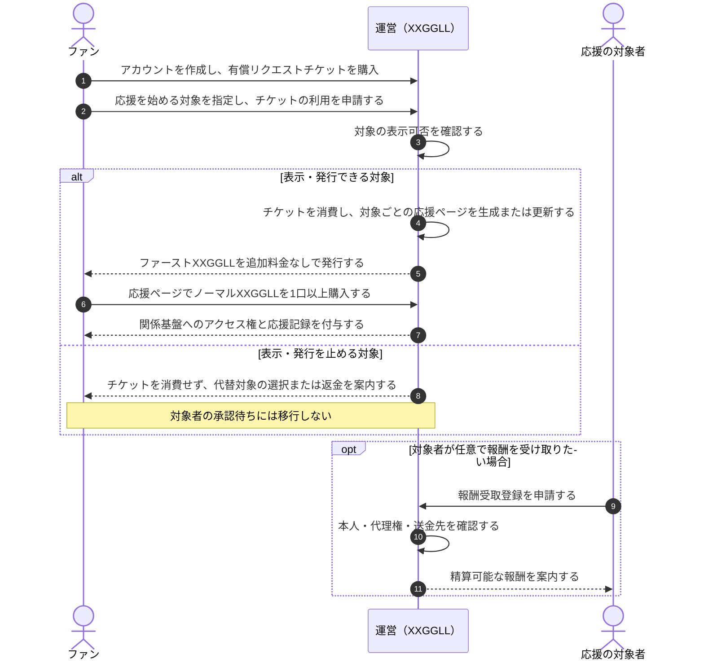

# 発行と参加の流れ

このページは、[コア体験](./overview.md)を成立させるための有償リクエスト、発行、購入の流れを扱う案である。
対象者への承認依頼、DM送付、対象者による管理操作は、この流れに含めない。

## ページの役割

| ページ | 利用者 | 役割 |
| --- | --- | --- |
| 応援ページ | ファン | 応援を始めた対象、ファーストXXGGLL、金銭と時間の別々の記録を確認し、ノーマルXXGGLLを購入する。 |
| 自分の記録 | ファン | 自分が保有するXXGGLL、応援の来歴、ユーザーランクを確認する。 |
| 報酬受取ページ | 対象者本人または正当な代理人 | 任意で本人・送金先を確認し、受け取れるクリエイター報酬を請求する。発行、公開、購入を承認するページではない。 |

応援ページは、対象者の公式ページや公認ページではない。対象者が承認、認知、参加していることを表示しない。

## 発行から参加まで

## 役務にしないこと

対象者は、承認、返信、投稿、配信、制作、発送、面会、個別対応を求められない。
報酬受取登録は任意であり、登録の有無によってファンの発行・保有・応援記録を変えない。

対象者または正当な権利者から、なりすまし、名称・肖像等の権利侵害、公開停止の申告があった場合は、
運営が応援ページの表示と新規販売を止め、記録・返金・報酬候補を個別に確認する。
この安全措置は対象者の承認を求めるための手順ではない。

同一の対象について複数の受取申請が競合した場合、運営は一方を先に送金せず、
本人性・代理権が確定するまで報酬候補を保留する。

ファンが保有するXXGGLLの種類、トークン、ランクは[XXGGLLとランク](./xxggll-and-ranks.md)で扱う。
